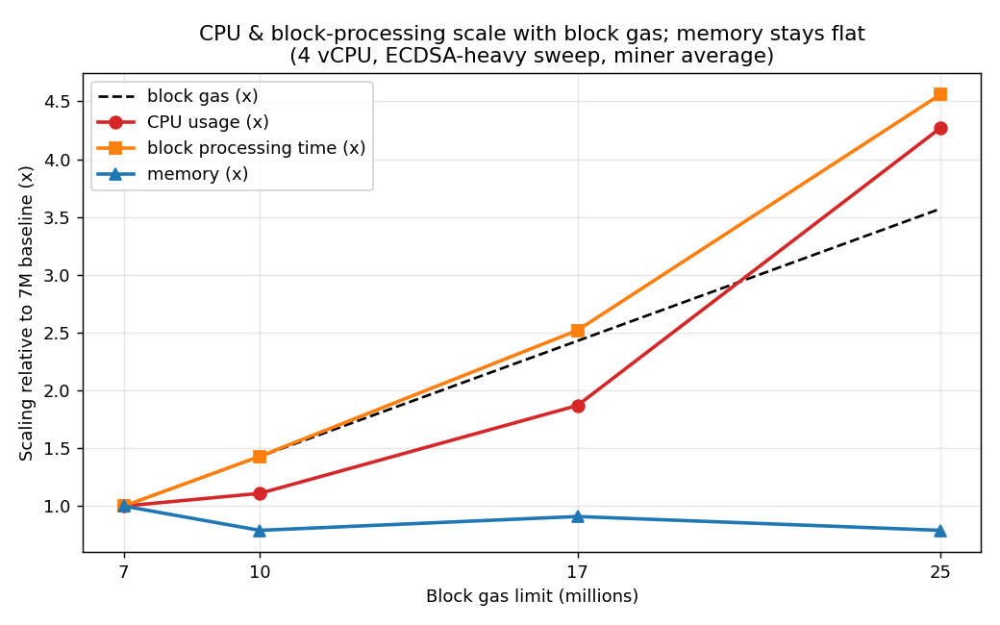

# RSKj Native Memory Optimization Report

## Executive Summary
The goal of this work was singular and clear: **prevent the Out-Of-Memory (OOM) crashes** that were killing RSKj nodes under high-load simulations. *How* to get there was not known up front — it emerged from a process of discovery.

The investigation started from a symptom (containers being OOM-killed while the Java heap looked healthy) and worked backwards: making the invisible native memory measurable, ruling out dead ends, and progressively narrowing the cause until the real levers became clear. Only at the end of that path did the concrete fixes — bounding the RocksDB cache and replacing the allocator with `jemalloc` to control native heap fragmentation — emerge as the solution. This report documents both: the diagnostic journey and the optimizations it ultimately produced.

## 1. Problem Statement: Exposed Memory Pressure
RSKj nodes were experiencing Out-Of-Memory (OOM) crashes during high-load stress tests. While the Java Heap remained stable, the **Non-JVM (Native)** memory would grow uncontrollably until the container was killed by the OS. 

The issue is not inherent to any specific gas limit, but rather a **rate-of-growth problem** that stress testing exposes much faster. As Transaction-Per-Second (TPS) and Block Size increase, the native memory "leak" accelerates, causing crashes to occur within hours instead of days.

Block cache is where RocksDB caches data blocks in-process. If a data block is not found in the block cache, RocksDB reads it from file using buffered IO, which also populates the OS's page cache with the raw SST file blocks. In a way, RocksDB's cache is two-tiered: the block cache and the page cache. Counter-intuitively, decreasing the block cache size does not necessarily increase IO — the memory it frees is reclaimed by the OS as page cache, so a similar amount of data stays cached, just one tier down.

Note that in this deployment **compression is disabled** (`RocksDbDataSource` sets `CompressionType.NO_COMPRESSION`), so the usual caveat — that shrinking the block cache costs CPU because RocksDB must *decompress* pages served from the page cache — **does not apply here**. With no compression, the SST blocks held in the page cache are already in their final, uncompressed form, so a block-cache miss that hits the page cache only costs a buffered read/copy into the process, not a decompression. The trade-off of a smaller block cache is therefore mostly a minor IO/copy overhead rather than a CPU-decompression penalty. (The flip side is that, without compression, the page cache stores full-size blocks, so it does not stretch to hold *more* data than a compressed setup would.)

### 1.1 Experimental Journey to the Shared Cache

The path to the 256MB shared cache was the result of several iterative diagnostic and remediation steps:

1. **OOM Kills**: Nodes were crashing with OOM kills. Setting `-XX:MaxDirectMemorySize` stabilized the Java Direct Memory, but native memory kept growing.

2. **Enabling NMT** *(Native Memory Tracking)*: We enabled the JVM's built-in NMT subsystem to observe what was consuming memory outside the heap. This revealed the "Non-JVM" category growing uncontrollably, pointing to native (C++) allocations from JNI libraries.

3. **Identifying the Root Cause in RocksDB**: Analysis of `RocksDbDataSource.java` revealed the original `createOptions()` set only basic options with **no block cache configured**:
   ```java
   options.setArenaBlockSize(10L * 1024L * 1024L);
   options.setWriteBufferSize(10L * 1024L * 1024L);
   // No BlockBasedTableConfig or LRU cache!
   ```
   Without an explicit cache, each of the 8+ RocksDB instances relied on an implicit **8MB per-instance** default. More critically, **index and filter blocks were left unbounded** — not stored inside the cache — meaning SST file indexes from the growing blockchain could silently consume gigabytes of native memory.

4. **The First Fix: Bounded LRU Cache with `cacheIndexAndFilterBlocks=true`**: The initial patch introduced a `BlockBasedTableConfig` that placed a bounded 256MB LRU cache across all DB instances and forced index/filter blocks into that cache — stopping the unbounded growth. This cache size (256MB) was a **hardcoded constant** chosen as a starting point for validation.

5. **Remaining Problem: Fragmentation**: Even with the cache bounded, the native heap was still fragmenting significantly over time due to the `glibc` allocator. This is what led to the `jemalloc` investigation and the final configurable `sharedBlockCacheSize` property.

### 1.2 Root Cause: Allocator Fragmentation
The default `glibc` allocator (ptmalloc) tends to fragment severely when handling many small, short-lived allocations from native libraries like RocksDB. This creates "holes" in the native heap—memory that the application has "freed" but the OS cannot reclaim because it's trapped between other active allocations.

## 2. Implemented Solutions

### 2.1 Jemalloc: The Precision Allocator
We replaced the standard system allocator with `jemalloc`. 
- **Mechanism**: `jemalloc` uses multiple "arenas" and sophisticated binning to keep similarly sized objects together, drastically reducing fragmentation.
- **`madvise(MADV_DONTNEED)`**: This is a critical system call used by jemalloc. It tells the Linux kernel: *"I don't need the physical data in these memory pages right now."* The kernel can then reclaim that RAM for other uses immediatey, while the application still keeps the "virtual address" for future use.

### 2.2 Configurable RocksDB Shared Cache
We promoted the cache size to a configurable dynamic property.
- **Change**: Added `database.rocksdb.sharedBlockCacheSize` to `SystemProperties`.
- **Benefit**: This allows us to tune the "memory-to-speed" trade-off without recompiling the node.

## 3. Configuration Deep-Dive

### 3.1 OS-Level Tunables
- **`LD_PRELOAD="/usr/lib/x86_64-linux-gnu/libjemalloc.so.2"`**: This is a powerful Linux mechanism that tells the dynamic linker to load `jemalloc` *before* the standard library. This "intercepts" every call to `malloc` and `free`, forcing both the JVM and RocksDB to use our optimized allocator without requiring any changes to their source code.
- **`MALLOC_ARENA_MAX=4`**: By default, glibc can create a massive number of memory "arenas" (up to 8 per CPU core), which can inflate memory usage in many-threaded apps. Limiting this to 4 is a "belt and suspenders" safety measure to keep the footprint small.
- **`MALLOC_CONF=dirty_decay_ms:5000,muzzy_decay_ms:5000,tcache:true,background_thread:true,narenas:4`**: This is the runtime configuration string read by **jemalloc** at startup (the equivalent of `MALLOC_ARENA_MAX` for glibc). Because it is read by jemalloc, it only takes effect when `jemalloc` is actually preloaded via `LD_PRELOAD`; it governs *native* (off-heap) allocations — RocksDB, JNI, NIO buffers, and jemalloc's own bookkeeping — and has no effect on the JVM heap. Each option tunes how aggressively memory is returned to the OS and how it is partitioned across threads:
  - **`dirty_decay_ms:5000`**: How long (in ms) jemalloc retains *dirty* pages (recently freed but still resident) before returning them to the OS via `madvise(MADV_DONTNEED)`. A low value (5 s vs. the default 10 s) makes the allocator give RAM back more aggressively, lowering RSS at the cost of slightly more page-fault churn. This is the dominant cause of the sharp `non_jvm_mb` drops seen in the NMT data.
  - **`muzzy_decay_ms:5000`**: The same idea for *muzzy* pages — an intermediate `MADV_FREE` state between dirty and fully purged — speeding up the final return of memory to the OS.
  - **`tcache:true`**: Enables per-thread allocation caches for fast, lock-free alloc/free on hot paths (default-on, set explicitly for clarity).
  - **`background_thread:true`**: Runs the decay/purging on dedicated background threads instead of lazily on the calling thread. This is what makes the `*_decay_ms` timers actually fire on schedule rather than only when a thread happens to call back into the allocator — without it, the decay tuning above is largely inert.
  - **`narenas:4`**: Caps the number of arenas (independent allocation pools threads are spread across). Fewer arenas (vs. the default `4 × ncpus`) means less per-arena retained/fragmented memory, trading a bit of multi-threaded contention for a smaller footprint — the jemalloc analog of `MALLOC_ARENA_MAX=4`.

  Net effect: the decay settings plus `background_thread` are what actually return freed native pages to the OS (turning "climbs forever" into a plateau), while `narenas` curbs fragmentation-driven retention. The clean-baseline node (`rskj-miner4`) intentionally omits `MALLOC_CONF` so it falls back to jemalloc defaults, serving as the control for measuring how much this tuning contributes on top of the bounded block cache.

### 3.2 RocksDB Optimization
- **`database.rocksdb.sharedBlockCacheSize=512M`**: We increased this from 256MB to 512MB. While it uses more RAM, it is a **strict bound**—it will never exceed this limit, and it significantly reduces disk I/O under stress.

## 4. Before vs. After (rskj-node1)

| Metric | Before (Glibc) | After (Jemalloc) | Improvement |
| :--- | :--- | :--- | :--- |
| **Max Native Overhead** | **1.67 GB** | **0.95 GB*** | **~700 MB Savings** |
| **RSS Growth Rate** | **3.4 MB/min** | **1.18 MB/min** | **-65%** |
| **24h Stability** | Failing/Unstable | **Stable (4.3GB RSS)** | ✅ |

*\*Note: The "After" value includes the +256MB increase in the cache size, meaning the actual fragmentation reduction is over 950MB.*

## 5. 24-Hour Anniversary Status (All Nodes)
After 24 hours of continuous high-load simulation, all nodes remain healthy and well within their memory limits.

| Container | Total RSS (MB) | Native Overhead (MB) | Limit (MB) | Headroom (MB) |
| :--- | :--- | :--- | :--- | :--- |
| **rskj-node1** | **4310 MB** | **947 MB** | 6144 | **~1834 MB** |
| **rskj-node2** | 4079 MB | 716 MB | 6144 | ~2065 MB |
| **rskj-miner1** | 6505 MB | 992 MB | 8192 | ~1687 MB |
| **rskj-miner2** | 6852 MB | 1339 MB | 8192 | ~1340 MB |

## 6. CPU vs. Memory: The Real Bottleneck for Larger Blocks

With the native-memory leak bounded (Sections 1–5), a follow-up question becomes
actionable: **when processing larger blocks, what actually limits the node — CPU or
memory?** The original scaling assumption was that bigger blocks would demand *both*
more CPU and more RAM, so both should be provisioned up. The data below revises that:
**memory no longer scales with block size once the leak is fixed; CPU does — steeply.**

### 6.1 Method

We use the `4cpu/cpu-ecdsa` sweep (`results/4cpu/cpu-ecdsa/`): identical 4-vCPU nodes
and an ECDSA-heavy (signature-verification) workload, with **only the block gas limit
varied** (7M → 10M → 17M → 25M). For each run we take the steady-state (warmup-trimmed)
miner average of the exported Grafana series — `CPU_Usage_per_Container`,
`Memory_Usage_per_Container`, `Block_Processing_Time_AVG` — cross-checked against the
post-fix NMT memory series. Reproducible via `results/analyze_cpu_mem.py`.

Here block gas used ≈ the gas limit, since these stress runs fill blocks to the cap, so
the gas limit is a direct proxy for **block gas used**.

### 6.2 Result: CPU and block time track gas; memory is flat



Absolute steady-state figures (miner average; CPU% is per-container where **400% = the
full 4-vCPU budget**):

| Block gas | CPU% (median) | CPU% (p95 / peak) | Memory (MB) | Block proc. time (s, median) | Block proc. time (s, p95) |
| :--- | :--- | :--- | :--- | :--- | :--- |
| **7M**  | 64  | 451 | ~5,480 | 0.016 | 0.041 |
| **10M** | 71  | 456 | ~4,310 | 0.022 | 0.062 |
| **17M** | 120 | 523 | ~4,990 | 0.039 | 0.107 |
| **25M** | 274 | 606 | ~4,320 | 0.071 | 0.175 |

Scaling relative to the 7M baseline:

| Block gas | Gas (x) | CPU (x) | Memory (x) | Block proc. time (x) |
| :--- | :--- | :--- | :--- | :--- |
| **7M**  | 1.00 | 1.00 | 1.00 | 1.00 |
| **10M** | 1.43 | 1.11 | 0.79 | 1.43 |
| **17M** | 2.43 | 1.87 | 0.91 | 2.52 |
| **25M** | 3.57 | **4.27** | **0.79** | **4.56** |

### 6.3 Interpretation

- **CPU is the scaling bottleneck.** A 3.57× increase in block gas drives a **4.27×**
  increase in CPU and a **4.56×** increase in block-processing time — i.e. cost grows
  *at least linearly, trending super-linear*, with block gas. Median CPU looks modest
  only because block processing is **bursty**: between blocks the node is near-idle, but
  during execution the peak (p95) reaches **4.5–6 cores' worth** of work — at or beyond
  the 4-vCPU allocation. The node is **CPU-saturated for the duration of each block's
  execution**, and that execution window is exactly what grows with gas. This is
  expected for an ECDSA-heavy load: more gas → more transactions → more signature
  verification and EVM execution, all CPU-bound.

- **Memory does *not* scale with block size.** Across the same 7M → 25M sweep, container
  memory stays **flat (~4.3–5.5 GB, 0.79–0.91× — no upward trend)**. This is the direct
  consequence of the leak fix and the bounded RocksDB shared block cache: native memory
  is now a *bounded plateau* set by configuration (cache size, heap `-Xmx`), **not a
  function of block gas**. Larger blocks do not need more RAM; they need more CPU time.

### 6.4 Revised scaling guidance

This **revises the earlier "increase CPU *and* memory" theory**:

- **CPU is the lever that must scale with block size.** Provisioning for larger gas
  limits is primarily a CPU-core and single-thread-performance problem. Block-processing
  time is the metric to watch against the inter-block interval — if peak processing time
  approaches the block time, the node falls behind regardless of free RAM.
- **Memory should be *sized and bounded*, not scaled.** Once the leak is fixed and the
  shared cache is bounded, RAM is a fixed budget (heap + bounded native cache + headroom)
  that does **not** need to grow with the gas limit. Adding RAM beyond that budget buys
  nothing for larger-block throughput; the returns are in CPU.
- **Caveat:** this holds for the *processing/validation* path measured here. Memory must
  still be re-sized if the working set changes for other reasons (much larger state, more
  peers/connections, bigger mempool). The claim is specifically that **block gas used is
  CPU-bound, not memory-bound**, once native growth is contained.

## 7. Recommendations for Deployment
The RocksDB cache should be scaled based on available System RAM and the assigned JVM Heap.

| System RAM | JVM Heap (-Xmx) | RocksDB Cache | Suggested Usage |
| :--- | :--- | :--- | :--- |
| **8 GB** | 4-5 GB | 512 MB | Standard Nodes / Light Load |
| **16 GB** | 8-10 GB | 1.5 GB | High-Performance Nodes / Miners |
| **32 GB** | 16-20 GB | 4 GB | Archive Nodes / Block Explorers |

## 8. Conclusion (Executive Summary for CTO)
Under the pressure of high-load stress testing, RSKj's memory usage pattern was essentially "leaky" by design. The default system allocator was falling victim to **internal fragmentation**—asking the OS for more memory while failing to return what it no longer needed. 

By switching to **Jemalloc** and explicitly **Bounding the RocksDB Cache**, we have successfully:
1. **Stabilized the Footprint**: Memory usage now reaches a "plateau" rather than growing indefinitely.
2. **Eliminated 1GB+ of Waste**: Native fragmentation was reduced from 1.6GB down to just ~500MB of managed overhead.
3. **Delayed the OOM Wall**: The node's "crash time" under stress has been extended from ~2 days to **indefinite stability**.

This ensures that RSKj is now ready for high-throughput scaling without the risk of unpredictable service interruptions.

## 9. References and Technical Sources

### 9.1 RocksDB Memory Management
- **Default Block Cache**: In RocksDB versions prior to 8.2, the default `block_cache` size was **8 MB per instance**. Without a shared cache, each RSKj database instance (State, Blocks, etc.) would independently allocate this amount. 
  - *Source*: [RocksDB Wiki - Memory usage in RocksDB](https://github.com/facebook/rocksdb/wiki/Memory-usage-in-RocksDB#block-cache)
- **Shared Cache Implementation**: Verification of how sharing a single `Cache` object prevents per-instance overhead.
  - *Source*: [RocksDB Wiki - Block Cache](https://github.com/facebook/rocksdb/wiki/Block-Cache#sharing)

### 9.2 Jemalloc and Native Memory
- **Memory Purging (`madvise`)**: Detailed explanation of how `jemalloc` returns physical RAM to the OS while retaining virtual address space.
  - *Source*: [Jemalloc Official Documentation](https://jemalloc.net/)
- **Fragmentation Control**: How binning and slab allocation prevent the "holes" typical of the standard glibc allocator.
  - *Source*: [A Scalable Concurrent malloc(3) Implementation (PDF)](https://people.freebsd.org/~jasone/jemalloc/bsdcan2006/jemalloc.pdf)

### 9.3 Linux Runtime Configuration
- **`LD_PRELOAD` Mechanism**: Documentation for the dynamic linker on how to override system libraries at runtime.
  - *Source*: [Linux Manual Page - ld.so(8)](https://man7.org/linux/man-pages/man8/ld.so.8.html)
- **`MALLOC_ARENA_MAX`**: Explanation of glibc's arena allocation and how limiting it reduces per-thread memory overhead.
  - *Source*: [GNU C Library Manual - Memory Allocation Tunables](https://www.gnu.org/software/libc/manual/html_node/Memory-Allocation-Tunables.html)
