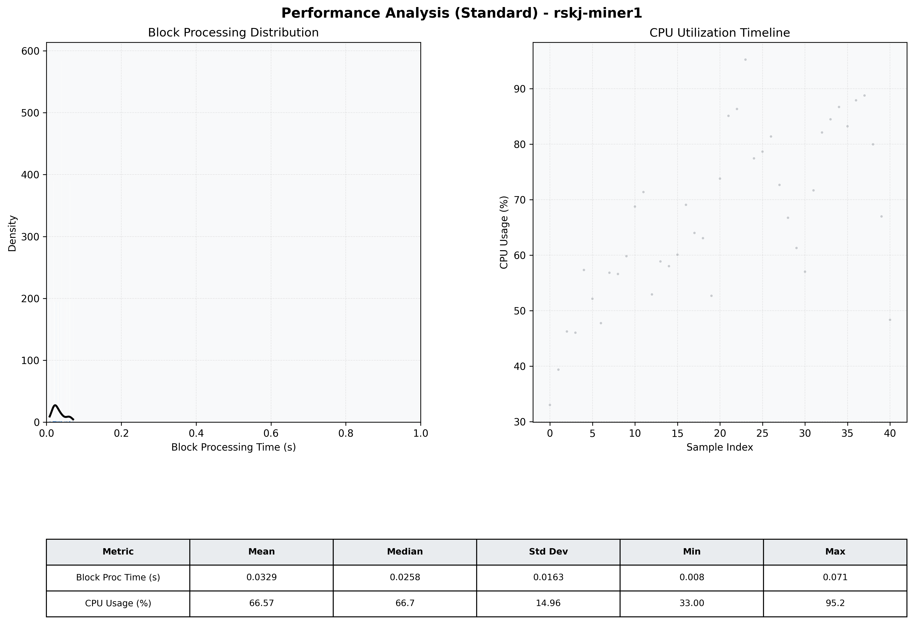

# Miner1 Quantitative Performance Report

| Category | Metric | Unit | Mean | Median | Min | Max |
| :--- | :--- | :--- | :--- | :--- | :--- | :--- |
| Processing | Block Processing Time | s | 0.033 | 0.026 | 0.008 | 0.071 |
|  | BlockExecution JMX | s | 0.025 | 0.018 | 0.004 | 0.067 |
| | Gas Consumed (per block) | M units | 5.66 | 6.86 | 0.00 | 6.97 |
| Resources | CPU Usage per Container | % | 66.57 | 66.73 | 33.00 | 95.23 |
|  | Memory Usage per Container | MiB | 1786.8 | 1783.3 | 1649.8 | 1924.4 |
| JVM | JVM Heap Used | MiB | 594.9 | 523.6 | 166.4 | 1083.7 |
| | JVM Heap Allocated | MiB | 2969.6 | 2969.6 | 2969.6 | 2969.6 |
| JVM GC | GC Copy Time | s | 0.0007 | 0.0007 | 0.000 | 0.001 |
| JVM GC | GC MarkSweep Time | s | 0.0000 | 0.0000 | 0.000 | 0.000 |
| Disk I/O | Disk Read | MiB/s | 0.000 | 0.000 | 0.000 | 0.000 |
|  | Disk Write | MiB/s | 215.893 | 206.621 | 3.448 | 428.429 |
| Network | Received Network Traffic per Container | KiB/s | 1150.45 | 1224.98 | 38.08 | 1401.68 |
|  | Sent Network Traffic per Container | KiB/s | 198.10 | 174.92 | 23.79 | 657.45 |

