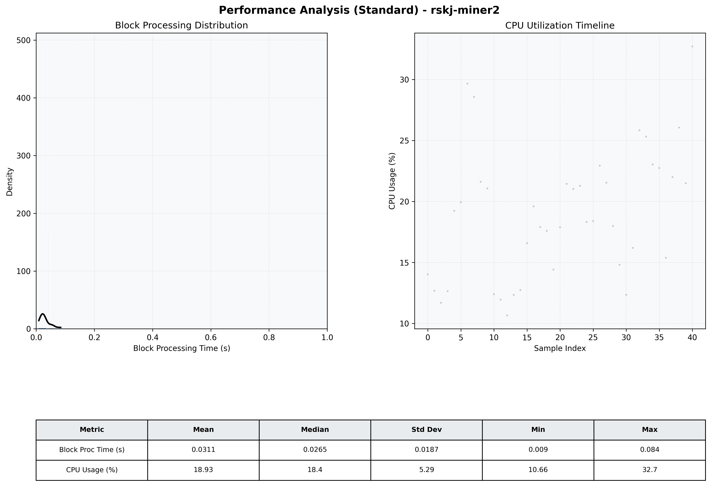

# Miner2 Quantitative Performance Report

| Category | Metric | Unit | Mean | Median | Min | Max |
| :--- | :--- | :--- | :--- | :--- | :--- | :--- |
| Processing | Block Processing Time | s | 0.031 | 0.027 | 0.009 | 0.084 |
|  | BlockExecution JMX | s | 0.023 | 0.015 | 0.006 | 0.072 |
| | Gas Consumed (per block) | M units | 5.66 | 6.86 | 0.00 | 6.97 |
| Resources | CPU Usage per Container | % | 18.93 | 18.39 | 10.66 | 32.71 |
|  | Memory Usage per Container | MiB | 1602.1 | 1604.4 | 1508.4 | 1666.0 |
| JVM | JVM Heap Used | MiB | 532.2 | 519.6 | 126.3 | 923.9 |
| | JVM Heap Allocated | MiB | 2969.6 | 2969.6 | 2969.6 | 2969.6 |
| JVM GC | GC Copy Time | s | 0.0005 | 0.0004 | 0.000 | 0.001 |
| JVM GC | GC MarkSweep Time | s | 0.0000 | 0.0000 | 0.000 | 0.000 |
| Disk I/O | Disk Read | MiB/s | 0.000 | 0.000 | 0.000 | 0.000 |
|  | Disk Write | MiB/s | 45.639 | 23.035 | 0.552 | 328.011 |
| Network | Received Network Traffic per Container | KiB/s | 137.36 | 89.37 | 1.21 | 678.68 |
|  | Sent Network Traffic per Container | KiB/s | 135.98 | 130.74 | 9.70 | 559.32 |

