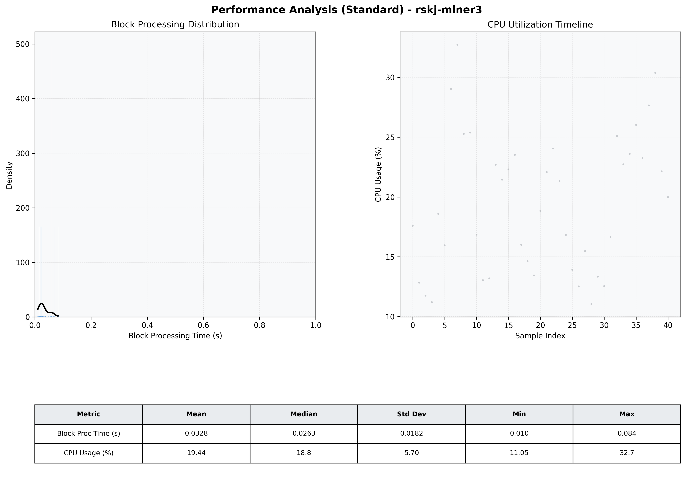

# Miner3 Quantitative Performance Report

| Category | Metric | Unit | Mean | Median | Min | Max |
| :--- | :--- | :--- | :--- | :--- | :--- | :--- |
| Processing | Block Processing Time | s | 0.033 | 0.026 | 0.010 | 0.084 |
|  | BlockExecution JMX | s | 0.024 | 0.017 | 0.005 | 0.077 |
| | Gas Consumed (per block) | M units | 5.66 | 6.86 | 0.00 | 6.97 |
| Resources | CPU Usage per Container | % | 19.44 | 18.83 | 11.05 | 32.73 |
|  | Memory Usage per Container | MiB | 2805.0 | 2799.3 | 2725.1 | 2869.8 |
| JVM | JVM Heap Used | MiB | 995.7 | 959.6 | 121.9 | 1831.9 |
| | JVM Heap Allocated | MiB | 3072.0 | 3072.0 | 3072.0 | 3072.0 |
| JVM GC | GC Copy Time | s | N/A | N/A | N/A | N/A |
| JVM GC | GC MarkSweep Time | s | N/A | N/A | N/A | N/A |
| Disk I/O | Disk Read | MiB/s | 0.000 | 0.000 | 0.000 | 0.000 |
|  | Disk Write | MiB/s | 45.487 | 22.621 | 1.379 | 328.011 |
| Network | Received Network Traffic per Container | KiB/s | 140.11 | 103.24 | 1.20 | 678.66 |
|  | Sent Network Traffic per Container | KiB/s | 121.57 | 82.51 | 9.40 | 558.82 |

