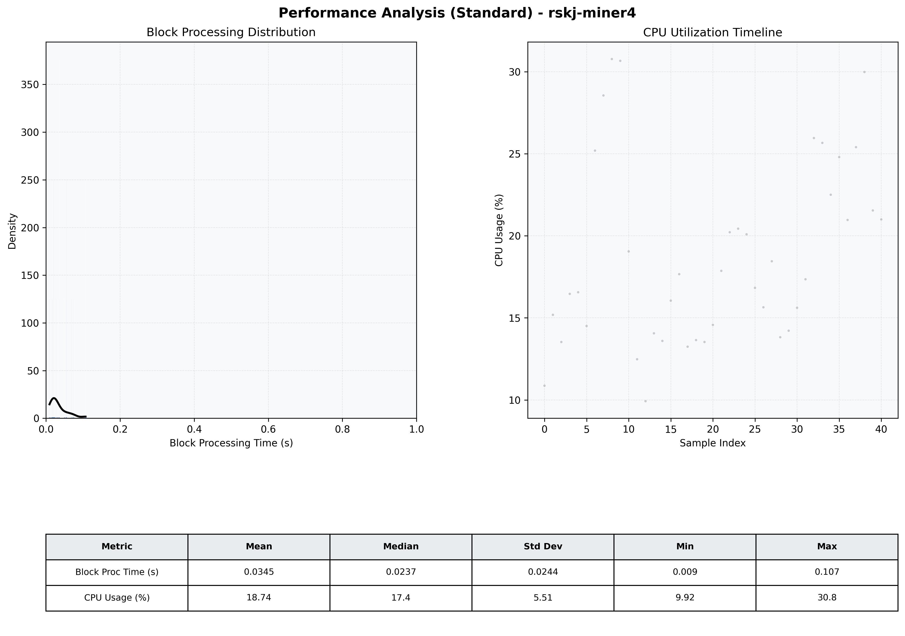

# Miner4 Quantitative Performance Report

| Category | Metric | Unit | Mean | Median | Min | Max |
| :--- | :--- | :--- | :--- | :--- | :--- | :--- |
| Processing | Block Processing Time | s | 0.035 | 0.024 | 0.009 | 0.107 |
|  | BlockExecution JMX | s | 0.025 | 0.014 | 0.004 | 0.093 |
| | Gas Consumed (per block) | M units | 5.66 | 6.86 | 0.00 | 6.97 |
| Resources | CPU Usage per Container | % | 18.74 | 17.35 | 9.92 | 30.77 |
|  | Memory Usage per Container | MiB | 1610.3 | 1613.1 | 1513.6 | 1676.7 |
| JVM | JVM Heap Used | MiB | 572.5 | 572.9 | 153.3 | 935.8 |
| | JVM Heap Allocated | MiB | 2969.6 | 2969.6 | 2969.6 | 2969.6 |
| JVM GC | GC Copy Time | s | 0.0004 | 0.0004 | 0.000 | 0.001 |
| JVM GC | GC MarkSweep Time | s | 0.0000 | 0.0000 | 0.000 | 0.000 |
| Disk I/O | Disk Read | MiB/s | 0.000 | 0.000 | 0.000 | 0.000 |
|  | Disk Write | MiB/s | 45.329 | 22.484 | 0.552 | 327.735 |
| Network | Received Network Traffic per Container | KiB/s | 137.82 | 103.14 | 1.16 | 678.22 |
|  | Sent Network Traffic per Container | KiB/s | 133.46 | 121.58 | 9.98 | 559.64 |

