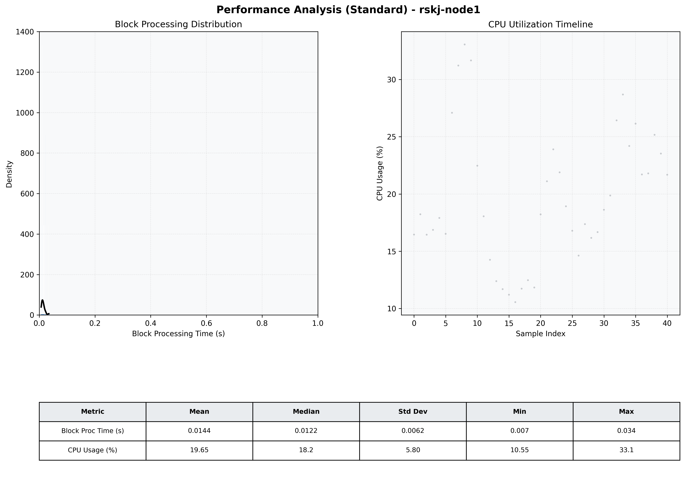

# Node1 Quantitative Performance Report

| Category | Metric | Unit | Mean | Median | Min | Max |
| :--- | :--- | :--- | :--- | :--- | :--- | :--- |
| Processing | Block Processing Time | s | 0.014 | 0.012 | 0.007 | 0.034 |
|  | BlockExecution JMX | s | 0.007 | 0.006 | 0.003 | 0.018 |
| | Gas Consumed (per block) | M units | 5.66 | 6.86 | 0.00 | 6.97 |
| Resources | CPU Usage per Container | % | 19.65 | 18.23 | 10.55 | 33.06 |
|  | Memory Usage per Container | MiB | 1566.5 | 1571.7 | 1491.1 | 1637.8 |
| JVM | JVM Heap Used | MiB | 495.8 | 499.3 | 90.5 | 902.5 |
| | JVM Heap Allocated | MiB | 2969.6 | 2969.6 | 2969.6 | 2969.6 |
| JVM GC | GC Copy Time | s | 0.0005 | 0.0005 | 0.000 | 0.001 |
| JVM GC | GC MarkSweep Time | s | 0.0000 | 0.0000 | 0.000 | 0.000 |
| Disk I/O | Disk Read | MiB/s | 0.000 | 0.000 | 0.000 | 0.000 |
|  | Disk Write | MiB/s | 44.142 | 21.787 | 1.379 | 322.908 |
| Network | Received Network Traffic per Container | KiB/s | 143.27 | 104.01 | 1.17 | 678.37 |
|  | Sent Network Traffic per Container | KiB/s | 106.04 | 68.56 | 9.93 | 559.31 |

