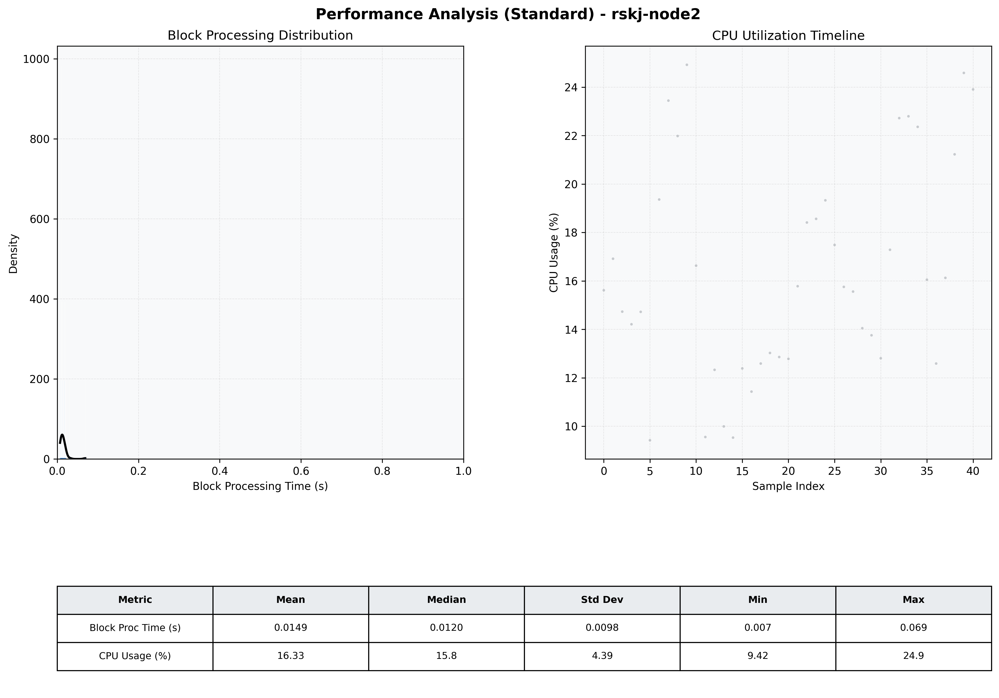

# Node2 Quantitative Performance Report

| Category | Metric | Unit | Mean | Median | Min | Max |
| :--- | :--- | :--- | :--- | :--- | :--- | :--- |
| Processing | Block Processing Time | s | 0.015 | 0.012 | 0.007 | 0.069 |
|  | BlockExecution JMX | s | 0.007 | 0.005 | 0.004 | 0.059 |
| | Gas Consumed (per block) | M units | 5.66 | 6.86 | 0.00 | 6.97 |
| Resources | CPU Usage per Container | % | 16.33 | 15.75 | 9.42 | 24.92 |
|  | Memory Usage per Container | MiB | 2743.1 | 2748.9 | 2679.7 | 2795.7 |
| JVM | JVM Heap Used | MiB | 986.6 | 935.9 | 125.2 | 1840.1 |
| | JVM Heap Allocated | MiB | 3072.0 | 3072.0 | 3072.0 | 3072.0 |
| JVM GC | GC Copy Time | s | N/A | N/A | N/A | N/A |
| JVM GC | GC MarkSweep Time | s | N/A | N/A | N/A | N/A |
| Disk I/O | Disk Read | MiB/s | 0.000 | 0.000 | 0.000 | 0.000 |
|  | Disk Write | MiB/s | 42.829 | 19.311 | 1.379 | 323.046 |
| Network | Received Network Traffic per Container | KiB/s | 143.29 | 104.06 | 1.21 | 678.34 |
|  | Sent Network Traffic per Container | KiB/s | 105.48 | 67.99 | 9.36 | 558.89 |

