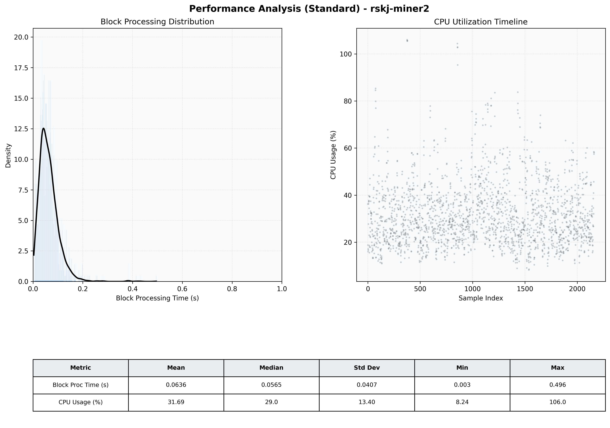

# Miner2 Quantitative Performance Report

| Category | Metric | Unit | Mean | Median | Min | Max |
| :--- | :--- | :--- | :--- | :--- | :--- | :--- |
| Processing | Block Processing Time | s | 0.064 | 0.057 | 0.003 | 0.496 |
|  | BlockExecution JMX | s | 0.045 | 0.036 | 0.003 | 0.592 |
| | Gas Consumed (per block) | M units | 6.95 | 8.44 | 0.00 | 9.93 |
| Resources | CPU Usage per Container | % | 31.69 | 28.98 | 8.24 | 106.01 |
|  | Memory Usage per Container | MiB | 3795.6 | 3967.1 | 2044.2 | 4071.0 |
| | CPU & Memory Assigned | - | 1.0 CPU, 4G | - | - | - |
| JVM | JVM Heap Used | MiB | 1795.2 | 1800.1 | 549.7 | 2871.4 |
| | JVM Heap Allocated | MiB | 2969.6 | 2969.6 | 2969.6 | 2969.6 |
| JVM GC | GC Copy Time | s | 0.0012 | 0.0012 | 0.000 | 0.008 |
| JVM GC | GC MarkSweep Time | s | 0.0001 | 0.0000 | 0.000 | 0.028 |
| Disk I/O | Disk Read | MiB/s | 174.414 | 20.276 | 0.000 | 15997.655 |
|  | Disk Write | MiB/s | 354.651 | 35.033 | 0.000 | 18791.945 |
| Network | Received Network Traffic per Container | KiB/s | 220.42 | 147.36 | 1.18 | 1517.39 |
|  | Sent Network Traffic per Container | KiB/s | 198.53 | 134.53 | 9.73 | 1349.80 |

