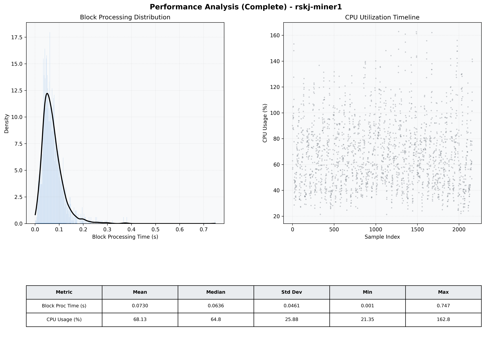

# Miner1 Quantitative Performance Report

| Category | Metric | Unit | Mean | Median | Min | Max |
| :--- | :--- | :--- | :--- | :--- | :--- | :--- |
| Processing | Block Processing Time | s | 0.073 | 0.064 | 0.001 | 0.747 |
|  | BlockExecution JMX | s | 0.054 | 0.044 | 0.004 | 2.348 |
| | Gas Consumed (per block) | M units | 6.95 | 8.44 | 0.00 | 9.93 |
| Resources | CPU Usage per Container | % | 68.13 | 64.81 | 21.35 | 162.85 |
|  | Memory Usage per Container | MiB | 3933.3 | 4042.6 | 2292.7 | 4096.0 |
| | CPU & Memory Assigned | - | 1.0 CPU, 4G | - | - | - |
| JVM | JVM Heap Used | MiB | 1834.2 | 1840.1 | 687.6 | 2890.3 |
| | JVM Heap Allocated | MiB | 2969.6 | 2969.6 | 2969.6 | 2969.6 |
| JVM GC | GC Copy Time | s | 0.0021 | 0.0020 | 0.000 | 0.012 |
| JVM GC | GC MarkSweep Time | s | 0.0002 | 0.0000 | 0.000 | 0.045 |
| Disk I/O | Disk Read | MiB/s | 335.784 | 42.622 | 0.000 | 20965.037 |
|  | Disk Write | MiB/s | 489.622 | 122.621 | 0.000 | 31190.151 |
| Network | Received Network Traffic per Container | KiB/s | 1260.86 | 1528.10 | 5.78 | 1980.32 |
|  | Sent Network Traffic per Container | KiB/s | 327.74 | 248.21 | 12.44 | 1706.04 |

