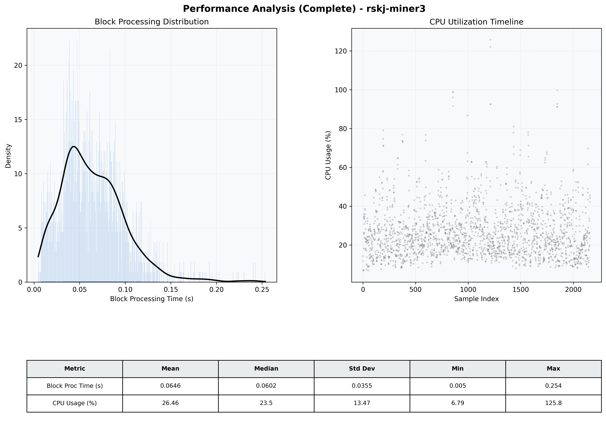

# Miner3 Quantitative Performance Report

| Category | Metric | Unit | Mean | Median | Min | Max |
| :--- | :--- | :--- | :--- | :--- | :--- | :--- |
| Processing | Block Processing Time | s | 0.065 | 0.060 | 0.005 | 0.254 |
|  | BlockExecution JMX | s | 0.046 | 0.039 | 0.003 | 0.296 |
| | Gas Consumed (per block) | M units | 6.95 | 8.44 | 0.00 | 9.93 |
| Resources | CPU Usage per Container | % | 26.46 | 23.47 | 6.79 | 125.76 |
|  | Memory Usage per Container | MiB | 3969.6 | 4020.6 | 3059.3 | 4095.7 |
| | CPU & Memory Assigned | - | 2.0 CPU, 4G | - | - | - |
| JVM | JVM Heap Used | MiB | 1787.9 | 1792.3 | 492.2 | 2652.2 |
| | JVM Heap Allocated | MiB | 3072.0 | 3072.0 | 3072.0 | 3072.0 |
| JVM GC | GC Copy Time | s | N/A | N/A | N/A | N/A |
| JVM GC | GC MarkSweep Time | s | N/A | N/A | N/A | N/A |
| Disk I/O | Disk Read | MiB/s | 255.855 | 32.691 | 0.000 | 16715.537 |
|  | Disk Write | MiB/s | 354.865 | 35.171 | 0.000 | 18805.600 |
| Network | Received Network Traffic per Container | KiB/s | 220.63 | 147.39 | 1.16 | 1516.95 |
|  | Sent Network Traffic per Container | KiB/s | 196.65 | 133.00 | 9.07 | 1318.26 |

