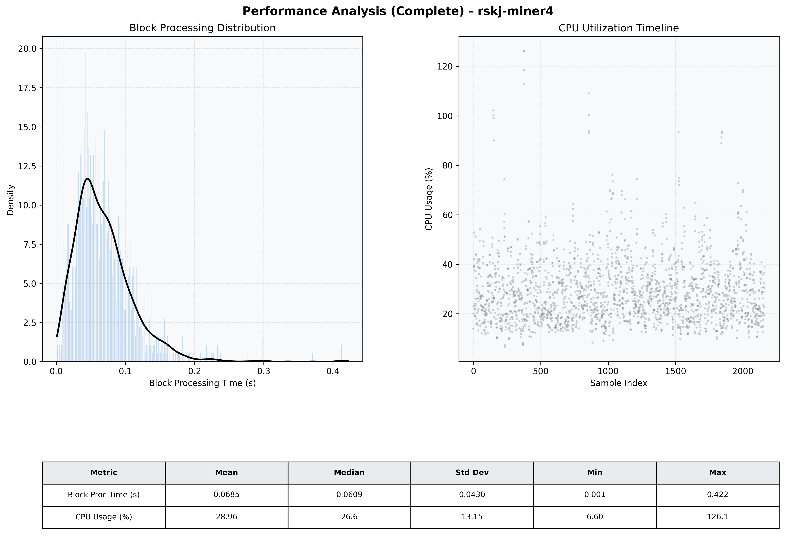

# Miner4 Quantitative Performance Report

| Category | Metric | Unit | Mean | Median | Min | Max |
| :--- | :--- | :--- | :--- | :--- | :--- | :--- |
| Processing | Block Processing Time | s | 0.069 | 0.061 | 0.001 | 0.422 |
|  | BlockExecution JMX | s | 0.050 | 0.040 | 0.004 | 0.399 |
| | Gas Consumed (per block) | M units | 6.95 | 8.44 | 0.00 | 9.93 |
| Resources | CPU Usage per Container | % | 28.96 | 26.58 | 6.60 | 126.15 |
|  | Memory Usage per Container | MiB | 3780.0 | 3952.1 | 2036.0 | 4095.8 |
| | CPU & Memory Assigned | - | 1.0 CPU, 4G | - | - | - |
| JVM | JVM Heap Used | MiB | 1796.6 | 1807.4 | 520.4 | 2879.5 |
| | JVM Heap Allocated | MiB | 2969.6 | 2969.6 | 2969.6 | 2969.6 |
| JVM GC | GC Copy Time | s | 0.0012 | 0.0012 | 0.000 | 0.008 |
| JVM GC | GC MarkSweep Time | s | 0.0001 | 0.0000 | 0.000 | 0.026 |
| Disk I/O | Disk Read | MiB/s | 132.573 | 19.860 | 0.000 | 15347.217 |
|  | Disk Write | MiB/s | 355.110 | 35.585 | 0.000 | 18765.051 |
| Network | Received Network Traffic per Container | KiB/s | 220.28 | 147.24 | 1.15 | 1486.52 |
|  | Sent Network Traffic per Container | KiB/s | 199.04 | 143.72 | 9.65 | 1412.09 |

