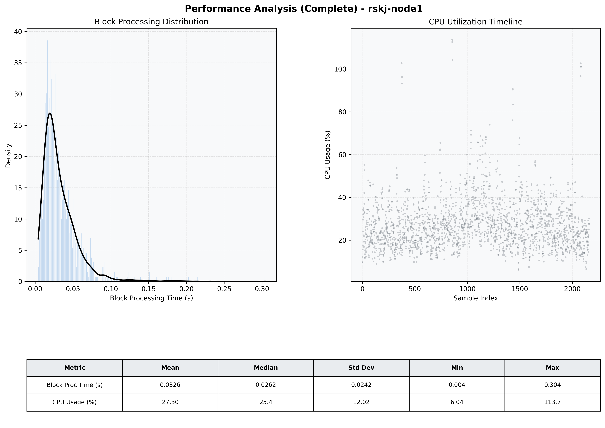

# Node1 Quantitative Performance Report

| Category | Metric | Unit | Mean | Median | Min | Max |
| :--- | :--- | :--- | :--- | :--- | :--- | :--- |
| Processing | Block Processing Time | s | 0.033 | 0.026 | 0.004 | 0.304 |
|  | BlockExecution JMX | s | 0.017 | 0.012 | 0.002 | 0.185 |
| | Gas Consumed (per block) | M units | 6.95 | 8.44 | 0.00 | 9.93 |
| Resources | CPU Usage per Container | % | 27.30 | 25.35 | 6.04 | 113.69 |
|  | Memory Usage per Container | MiB | 3801.2 | 3961.2 | 1940.7 | 4094.2 |
| | CPU & Memory Assigned | - | 1.0 CPU, 4G | - | - | - |
| JVM | JVM Heap Used | MiB | 1739.3 | 1755.4 | 380.0 | 2851.5 |
| | JVM Heap Allocated | MiB | 2969.6 | 2969.6 | 2969.6 | 2969.6 |
| JVM GC | GC Copy Time | s | 0.0011 | 0.0011 | 0.000 | 0.008 |
| JVM GC | GC MarkSweep Time | s | 0.0001 | 0.0000 | 0.000 | 0.022 |
| Disk I/O | Disk Read | MiB/s | 168.263 | 17.931 | 0.000 | 19259.172 |
|  | Disk Write | MiB/s | 359.130 | 33.931 | 0.000 | 18781.877 |
| Network | Received Network Traffic per Container | KiB/s | 233.40 | 165.18 | 1.18 | 1535.90 |
|  | Sent Network Traffic per Container | KiB/s | 190.06 | 126.81 | 9.97 | 1171.54 |

