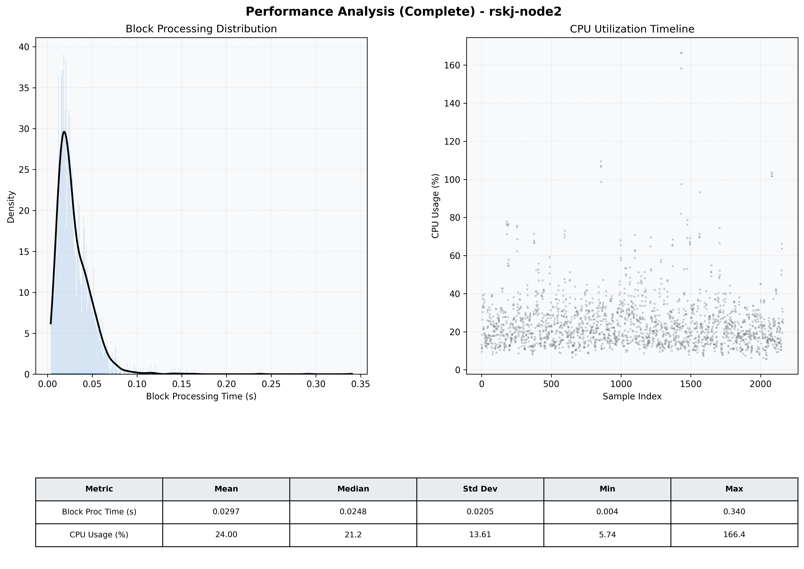

# Node2 Quantitative Performance Report

| Category | Metric | Unit | Mean | Median | Min | Max |
| :--- | :--- | :--- | :--- | :--- | :--- | :--- |
| Processing | Block Processing Time | s | 0.030 | 0.025 | 0.004 | 0.340 |
|  | BlockExecution JMX | s | 0.014 | 0.011 | 0.002 | 0.328 |
| | Gas Consumed (per block) | M units | 6.95 | 8.44 | 0.00 | 9.93 |
| Resources | CPU Usage per Container | % | 24.00 | 21.17 | 5.74 | 166.45 |
|  | Memory Usage per Container | MiB | 4871.3 | 4933.1 | 3031.2 | 5932.5 |
| | CPU & Memory Assigned | - | 2.0 CPU, 8G | - | - | - |
| JVM | JVM Heap Used | MiB | 1769.7 | 1783.1 | 389.6 | 2664.1 |
| | JVM Heap Allocated | MiB | 3072.0 | 3072.0 | 3072.0 | 3072.0 |
| JVM GC | GC Copy Time | s | N/A | N/A | N/A | N/A |
| JVM GC | GC MarkSweep Time | s | N/A | N/A | N/A | N/A |
| Disk I/O | Disk Read | MiB/s | 0.009 | 0.000 | 0.000 | 4.552 |
|  | Disk Write | MiB/s | 352.107 | 32.968 | 0.000 | 18791.670 |
| Network | Received Network Traffic per Container | KiB/s | 227.73 | 160.55 | 1.18 | 1530.25 |
|  | Sent Network Traffic per Container | KiB/s | 160.90 | 98.49 | 9.17 | 1141.30 |

