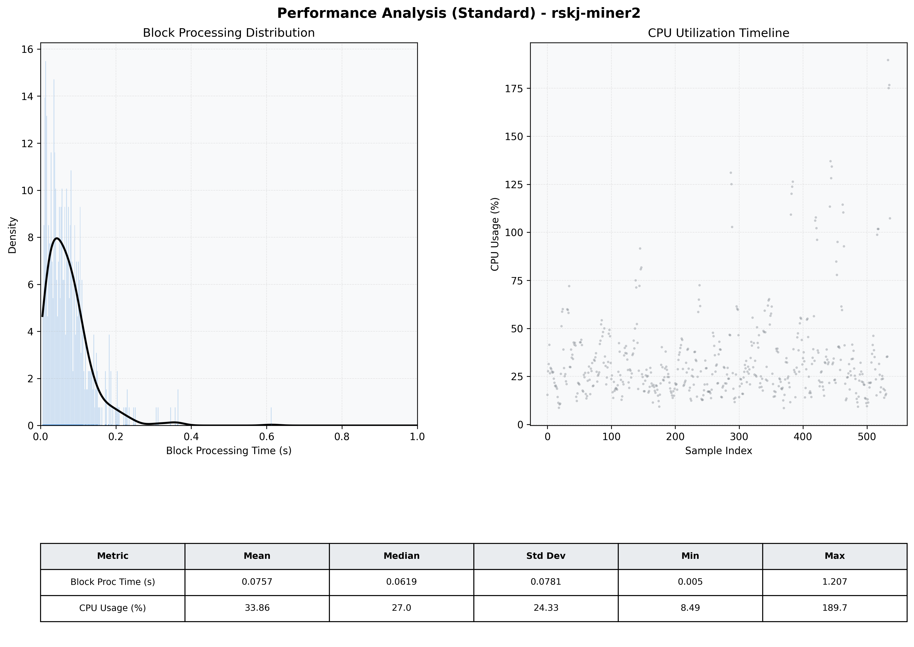

# Miner2 Quantitative Performance Report

| Category | Metric | Unit | Mean | Median | Min | Max |
| :--- | :--- | :--- | :--- | :--- | :--- | :--- |
| Processing | Block Processing Time | s | 0.076 | 0.062 | 0.005 | 1.207 |
|  | BlockExecution JMX | s | 0.055 | 0.040 | 0.003 | 0.575 |
| | Gas Consumed (per block) | M units | 9.78 | 10.56 | 0.00 | 16.98 |
| Resources | CPU Usage per Container | % | 33.86 | 27.03 | 8.49 | 189.69 |
|  | Memory Usage per Container | MiB | 3240.6 | 3785.3 | 750.4 | 4095.9 |
| | CPU & Memory Assigned | - | 1.0 CPU, 4G | - | - | - |
| JVM | JVM Heap Used | MiB | 1623.5 | 1707.4 | 89.9 | 2822.1 |
| | JVM Heap Allocated | MiB | 2969.6 | 2969.6 | 2969.6 | 2969.6 |
| JVM GC | GC Copy Time | s | 0.0031 | 0.0016 | 0.000 | 0.030 |
| JVM GC | GC MarkSweep Time | s | 0.0017 | 0.0000 | 0.000 | 0.343 |
| Disk I/O | Disk Read | MiB/s | 16.391 | 0.000 | 0.000 | 3751.319 |
|  | Disk Write | MiB/s | 186.422 | 11.861 | 0.000 | 10346.783 |
| Network | Received Network Traffic per Container | KiB/s | 164.02 | 88.64 | 0.60 | 1330.21 |
|  | Sent Network Traffic per Container | KiB/s | 141.52 | 59.86 | 4.62 | 1080.47 |

