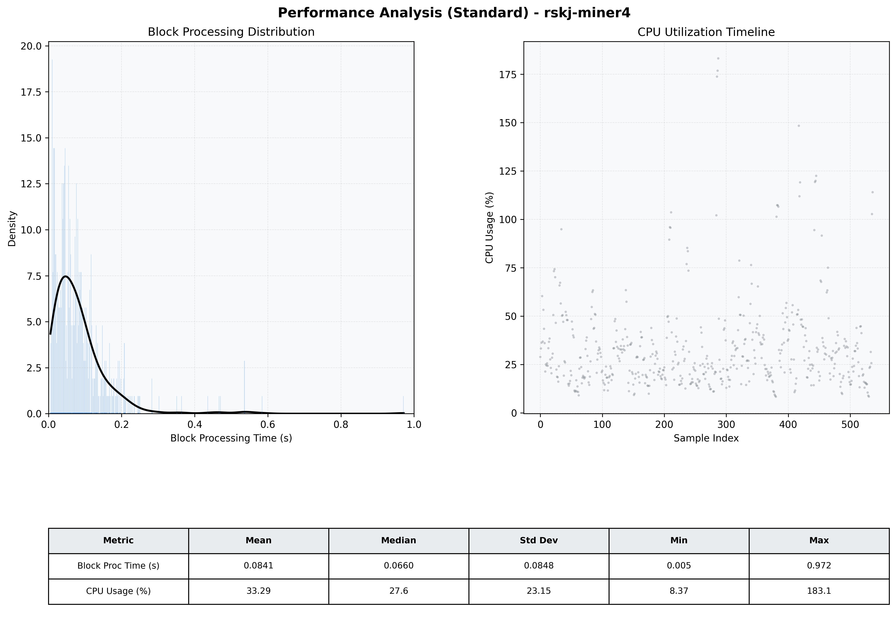

# Miner4 Quantitative Performance Report

| Category | Metric | Unit | Mean | Median | Min | Max |
| :--- | :--- | :--- | :--- | :--- | :--- | :--- |
| Processing | Block Processing Time | s | 0.084 | 0.066 | 0.005 | 0.972 |
|  | BlockExecution JMX | s | 0.064 | 0.045 | 0.004 | 0.939 |
| | Gas Consumed (per block) | M units | 9.78 | 10.56 | 0.00 | 16.98 |
| Resources | CPU Usage per Container | % | 33.29 | 27.57 | 8.37 | 183.11 |
|  | Memory Usage per Container | MiB | 3284.6 | 3888.3 | 659.7 | 4095.4 |
| | CPU & Memory Assigned | - | 1.0 CPU, 4G | - | - | - |
| JVM | JVM Heap Used | MiB | 1648.7 | 1747.6 | 62.4 | 2841.1 |
| | JVM Heap Allocated | MiB | 2969.6 | 2969.6 | 2969.6 | 2969.6 |
| JVM GC | GC Copy Time | s | 0.0031 | 0.0016 | 0.000 | 0.029 |
| JVM GC | GC MarkSweep Time | s | 0.0019 | 0.0000 | 0.000 | 0.317 |
| Disk I/O | Disk Read | MiB/s | 29.294 | 0.000 | 0.000 | 6453.602 |
|  | Disk Write | MiB/s | 183.922 | 13.241 | 0.000 | 10346.783 |
| Network | Received Network Traffic per Container | KiB/s | 161.68 | 86.44 | 0.54 | 1203.28 |
|  | Sent Network Traffic per Container | KiB/s | 145.27 | 66.30 | 4.29 | 1163.90 |

