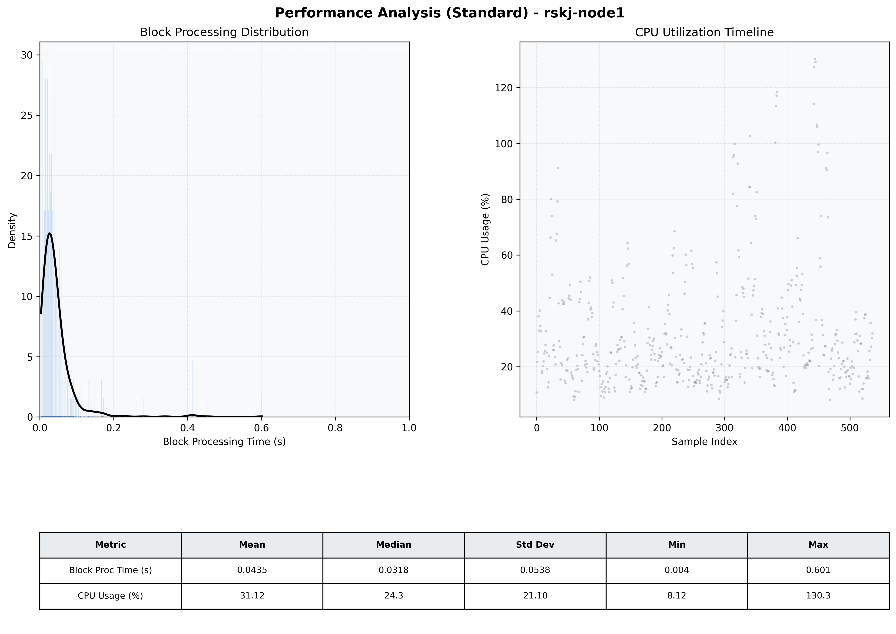

# Node1 Quantitative Performance Report

| Category | Metric | Unit | Mean | Median | Min | Max |
| :--- | :--- | :--- | :--- | :--- | :--- | :--- |
| Processing | Block Processing Time | s | 0.044 | 0.032 | 0.004 | 0.601 |
|  | BlockExecution JMX | s | 0.023 | 0.015 | 0.002 | 0.451 |
| | Gas Consumed (per block) | M units | 9.78 | 10.56 | 0.00 | 16.98 |
| Resources | CPU Usage per Container | % | 31.12 | 24.30 | 8.12 | 130.29 |
|  | Memory Usage per Container | MiB | 3174.2 | 3627.0 | 641.9 | 4088.9 |
| | CPU & Memory Assigned | - | 1.0 CPU, 4G | - | - | - |
| JVM | JVM Heap Used | MiB | 1613.8 | 1722.0 | 43.9 | 2870.7 |
| | JVM Heap Allocated | MiB | 2969.6 | 2969.6 | 2969.6 | 2969.6 |
| JVM GC | GC Copy Time | s | 0.0026 | 0.0014 | 0.000 | 0.017 |
| JVM GC | GC MarkSweep Time | s | 0.0017 | 0.0000 | 0.000 | 0.330 |
| Disk I/O | Disk Read | MiB/s | 28.381 | 0.000 | 0.000 | 6197.869 |
|  | Disk Write | MiB/s | 180.103 | 6.896 | 0.000 | 10346.783 |
| Network | Received Network Traffic per Container | KiB/s | 167.75 | 86.35 | 0.54 | 1203.27 |
|  | Sent Network Traffic per Container | KiB/s | 111.99 | 57.78 | 2.99 | 933.68 |

