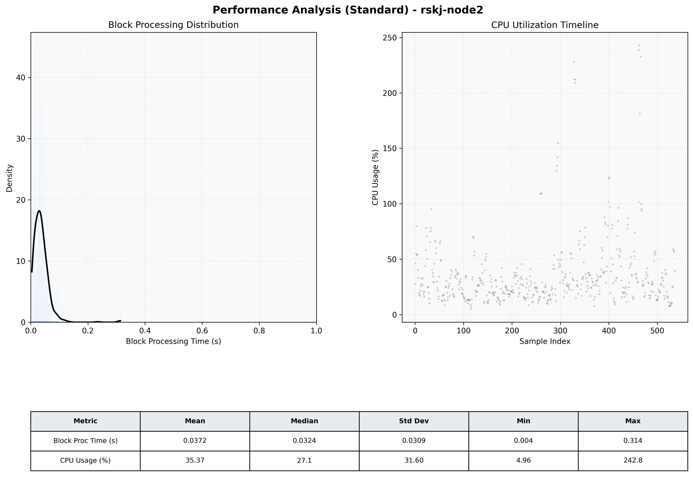

# Node2 Quantitative Performance Report

| Category | Metric | Unit | Mean | Median | Min | Max |
| :--- | :--- | :--- | :--- | :--- | :--- | :--- |
| Processing | Block Processing Time | s | 0.037 | 0.032 | 0.004 | 0.314 |
|  | BlockExecution JMX | s | 0.018 | 0.016 | 0.002 | 0.173 |
| | Gas Consumed (per block) | M units | 9.78 | 10.56 | 0.00 | 16.98 |
| Resources | CPU Usage per Container | % | 35.37 | 27.07 | 4.96 | 242.78 |
|  | Memory Usage per Container | MiB | 2273.3 | 2614.5 | 646.3 | 2774.7 |
| | CPU & Memory Assigned | - | 4.0 CPU, 8G | - | - | - |
| JVM | JVM Heap Used | MiB | 1679.6 | 1724.9 | 77.1 | 2656.5 |
| | JVM Heap Allocated | MiB | 3072.0 | 3072.0 | 3072.0 | 3072.0 |
| JVM GC | GC Copy Time | s | N/A | N/A | N/A | N/A |
| JVM GC | GC MarkSweep Time | s | N/A | N/A | N/A | N/A |
| Disk I/O | Disk Read | MiB/s | 0.001 | 0.000 | 0.000 | 0.140 |
|  | Disk Write | MiB/s | 211.637 | 11.587 | 0.000 | 14664.414 |
| Network | Received Network Traffic per Container | KiB/s | 168.04 | 86.52 | 0.00 | 1265.27 |
|  | Sent Network Traffic per Container | KiB/s | 110.44 | 41.74 | 0.00 | 933.60 |

