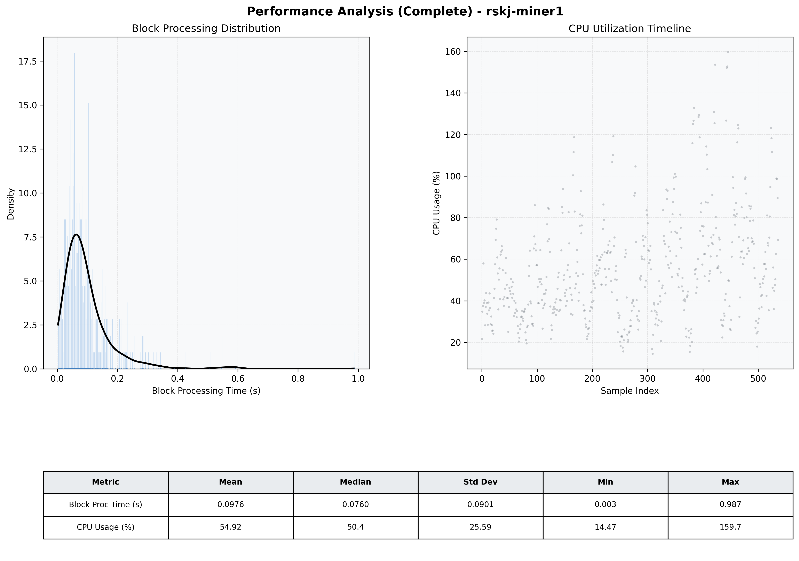

# Miner1 Quantitative Performance Report

| Category | Metric | Unit | Mean | Median | Min | Max |
| :--- | :--- | :--- | :--- | :--- | :--- | :--- |
| Processing | Block Processing Time | s | 0.098 | 0.076 | 0.003 | 0.987 |
|  | BlockExecution JMX | s | 0.074 | 0.056 | 0.002 | 0.796 |
| | Gas Consumed (per block) | M units | 9.78 | 10.56 | 0.00 | 16.98 |
| Resources | CPU Usage per Container | % | 54.92 | 50.40 | 14.47 | 159.66 |
|  | Memory Usage per Container | MiB | 3390.6 | 3965.6 | 756.4 | 4096.0 |
| | CPU & Memory Assigned | - | 1.0 CPU, 4G | - | - | - |
| JVM | JVM Heap Used | MiB | 1728.2 | 1814.3 | 114.8 | 2831.7 |
| | JVM Heap Allocated | MiB | 2969.6 | 2969.6 | 2969.6 | 2969.6 |
| JVM GC | GC Copy Time | s | 0.0042 | 0.0029 | 0.000 | 0.022 |
| JVM GC | GC MarkSweep Time | s | 0.0024 | 0.0000 | 0.000 | 0.324 |
| Disk I/O | Disk Read | MiB/s | 47.160 | 0.000 | 0.000 | 6548.640 |
|  | Disk Write | MiB/s | 208.004 | 32.966 | 0.000 | 10418.236 |
| Network | Received Network Traffic per Container | KiB/s | 571.29 | 552.98 | 1.41 | 1755.43 |
|  | Sent Network Traffic per Container | KiB/s | 233.03 | 165.96 | 0.30 | 1545.76 |

