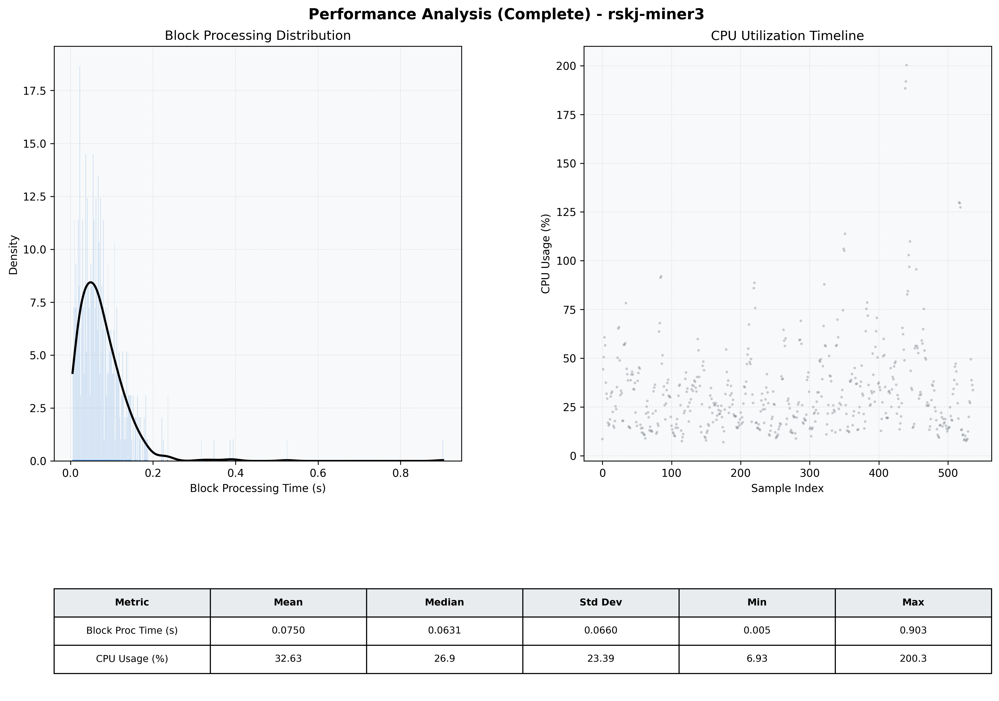

# Miner3 Quantitative Performance Report

| Category | Metric | Unit | Mean | Median | Min | Max |
| :--- | :--- | :--- | :--- | :--- | :--- | :--- |
| Processing | Block Processing Time | s | 0.075 | 0.063 | 0.005 | 0.903 |
|  | BlockExecution JMX | s | 0.054 | 0.041 | 0.002 | 0.895 |
| | Gas Consumed (per block) | M units | 9.78 | 10.56 | 0.00 | 16.98 |
| Resources | CPU Usage per Container | % | 32.63 | 26.92 | 6.93 | 200.33 |
|  | Memory Usage per Container | MiB | 3789.5 | 4022.5 | 656.8 | 4095.7 |
| | CPU & Memory Assigned | - | 2.0 CPU, 4G | - | - | - |
| JVM | JVM Heap Used | MiB | 1741.5 | 1808.2 | 94.5 | 2657.1 |
| | JVM Heap Allocated | MiB | 3072.0 | 3072.0 | 3072.0 | 3072.0 |
| JVM GC | GC Copy Time | s | N/A | N/A | N/A | N/A |
| JVM GC | GC MarkSweep Time | s | N/A | N/A | N/A | N/A |
| Disk I/O | Disk Read | MiB/s | 121.136 | 0.000 | 0.000 | 8738.345 |
|  | Disk Write | MiB/s | 204.693 | 19.448 | 0.000 | 10570.847 |
| Network | Received Network Traffic per Container | KiB/s | 162.52 | 86.05 | 0.57 | 1203.21 |
|  | Sent Network Traffic per Container | KiB/s | 139.01 | 75.78 | 4.38 | 1043.59 |

