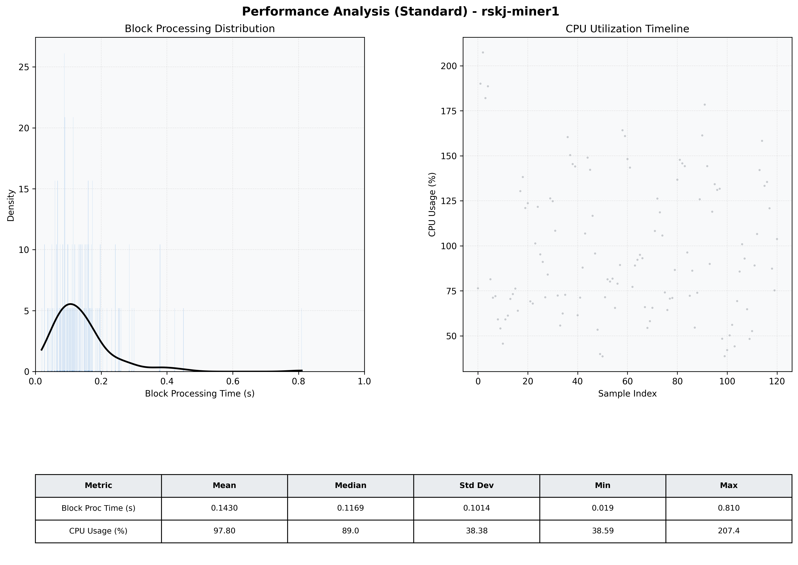

# Miner1 Quantitative Performance Report

| Category | Metric | Unit | Mean | Median | Min | Max |
| :--- | :--- | :--- | :--- | :--- | :--- | :--- |
| Processing | Block Processing Time | s | 0.143 | 0.117 | 0.019 | 0.810 |
|  | BlockExecution JMX | s | 0.111 | 0.081 | 0.007 | 0.537 |
| | Gas Consumed (per block) | M units | 19.54 | 24.70 | 0.00 | 24.71 |
| Resources | CPU Usage per Container | % | 97.80 | 89.05 | 38.59 | 207.41 |
|  | Memory Usage per Container | MiB | 4032.1 | 4026.3 | 3952.4 | 4095.0 |
| | CPU & Memory Assigned | - | 1.0 CPU, 4G | - | - | - |
| JVM | JVM Heap Used | MiB | 2280.5 | 2266.8 | 1680.1 | 2867.3 |
| | JVM Heap Allocated | MiB | 2969.6 | 2969.6 | 2969.6 | 2969.6 |
| JVM GC | GC Copy Time | s | 0.0082 | 0.0074 | 0.000 | 0.028 |
| JVM GC | GC MarkSweep Time | s | 0.0140 | 0.0000 | 0.000 | 0.269 |
| Disk I/O | Disk Read | MiB/s | 831.387 | 126.211 | 0.000 | 14508.414 |
|  | Disk Write | MiB/s | 0.001 | 0.000 | 0.000 | 0.016 |
| Network | Received Network Traffic per Container | KiB/s | 1155.12 | 1259.83 | 4.23 | 1497.95 |
|  | Sent Network Traffic per Container | KiB/s | 607.31 | 531.76 | 13.00 | 2344.09 |

