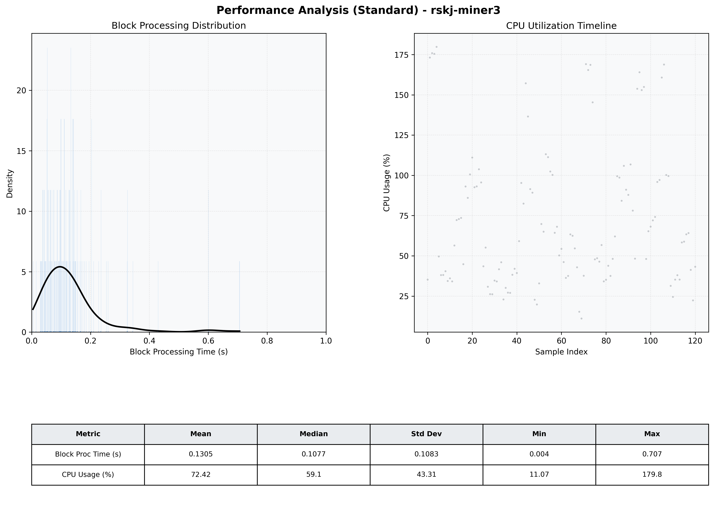

# Miner3 Quantitative Performance Report

| Category | Metric | Unit | Mean | Median | Min | Max |
| :--- | :--- | :--- | :--- | :--- | :--- | :--- |
| Processing | Block Processing Time | s | 0.130 | 0.108 | 0.004 | 0.707 |
|  | BlockExecution JMX | s | 0.094 | 0.069 | 0.004 | 0.627 |
| | Gas Consumed (per block) | M units | 19.54 | 24.70 | 0.00 | 24.71 |
| Resources | CPU Usage per Container | % | 72.42 | 59.12 | 11.07 | 179.77 |
|  | Memory Usage per Container | MiB | 4027.7 | 4026.2 | 3960.1 | 4095.7 |
| | CPU & Memory Assigned | - | 2.0 CPU, 4G | - | - | - |
| JVM | JVM Heap Used | MiB | 2342.0 | 2336.0 | 1879.4 | 2839.3 |
| | JVM Heap Allocated | MiB | 3072.0 | 3072.0 | 3072.0 | 3072.0 |
| JVM GC | GC Copy Time | s | N/A | N/A | N/A | N/A |
| JVM GC | GC MarkSweep Time | s | N/A | N/A | N/A | N/A |
| Disk I/O | Disk Read | MiB/s | 771.962 | 126.211 | 0.000 | 15075.756 |
|  | Disk Write | MiB/s | 962.051 | 113.655 | 0.000 | 17329.333 |
| Network | Received Network Traffic per Container | KiB/s | 451.81 | 366.75 | 3.78 | 1874.73 |
|  | Sent Network Traffic per Container | KiB/s | 417.04 | 320.05 | 11.63 | 1513.19 |

