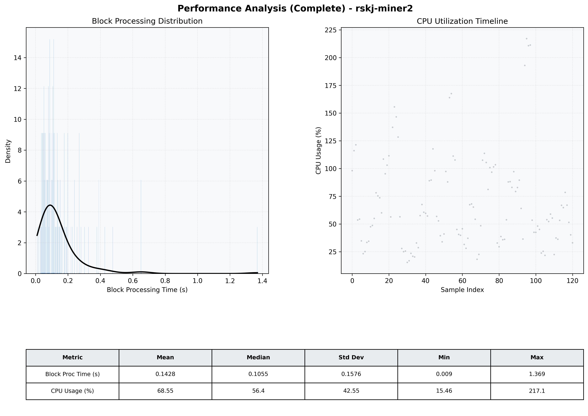

# Miner2 Quantitative Performance Report

| Category | Metric | Unit | Mean | Median | Min | Max |
| :--- | :--- | :--- | :--- | :--- | :--- | :--- |
| Processing | Block Processing Time | s | 0.143 | 0.105 | 0.009 | 1.369 |
|  | BlockExecution JMX | s | 0.108 | 0.069 | 0.008 | 1.327 |
| | Gas Consumed (per block) | M units | 19.54 | 24.70 | 0.00 | 24.71 |
| Resources | CPU Usage per Container | % | 68.55 | 56.44 | 15.46 | 217.07 |
|  | Memory Usage per Container | MiB | 4016.0 | 4012.3 | 3945.0 | 4095.4 |
| | CPU & Memory Assigned | - | 1.0 CPU, 4G | - | - | - |
| JVM | JVM Heap Used | MiB | 2282.0 | 2279.8 | 1667.4 | 2836.0 |
| | JVM Heap Allocated | MiB | 2969.6 | 2969.6 | 2969.6 | 2969.6 |
| JVM GC | GC Copy Time | s | 0.0055 | 0.0046 | 0.000 | 0.018 |
| JVM GC | GC MarkSweep Time | s | 0.0121 | 0.0000 | 0.000 | 0.300 |
| Disk I/O | Disk Read | MiB/s | 739.371 | 121.931 | 0.000 | 13254.345 |
|  | Disk Write | MiB/s | 966.643 | 125.241 | 0.000 | 16063.862 |
| Network | Received Network Traffic per Container | KiB/s | 458.48 | 397.02 | 3.83 | 1767.18 |
|  | Sent Network Traffic per Container | KiB/s | 451.11 | 358.00 | 8.67 | 2029.82 |

