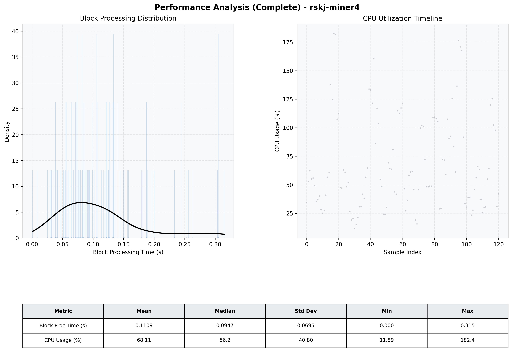

# Miner4 Quantitative Performance Report

| Category | Metric | Unit | Mean | Median | Min | Max |
| :--- | :--- | :--- | :--- | :--- | :--- | :--- |
| Processing | Block Processing Time | s | 0.111 | 0.095 | 0.000 | 0.315 |
|  | BlockExecution JMX | s | 0.078 | 0.062 | 0.005 | 0.695 |
| | Gas Consumed (per block) | M units | 19.54 | 24.70 | 0.00 | 24.71 |
| Resources | CPU Usage per Container | % | 68.11 | 56.16 | 11.89 | 182.40 |
|  | Memory Usage per Container | MiB | 4042.6 | 4039.4 | 3974.9 | 4095.6 |
| | CPU & Memory Assigned | - | 1.0 CPU, 4G | - | - | - |
| JVM | JVM Heap Used | MiB | 2353.8 | 2406.6 | 1838.6 | 2842.3 |
| | JVM Heap Allocated | MiB | 2969.6 | 2969.6 | 2969.6 | 2969.6 |
| JVM GC | GC Copy Time | s | 0.0051 | 0.0047 | 0.000 | 0.016 |
| JVM GC | GC MarkSweep Time | s | 0.0133 | 0.0000 | 0.000 | 0.306 |
| Disk I/O | Disk Read | MiB/s | 781.360 | 126.211 | 0.000 | 13878.069 |
|  | Disk Write | MiB/s | 966.384 | 118.625 | 0.552 | 16068.138 |
| Network | Received Network Traffic per Container | KiB/s | 473.37 | 405.77 | 3.80 | 1823.30 |
|  | Sent Network Traffic per Container | KiB/s | 358.88 | 287.01 | 6.40 | 1823.51 |

