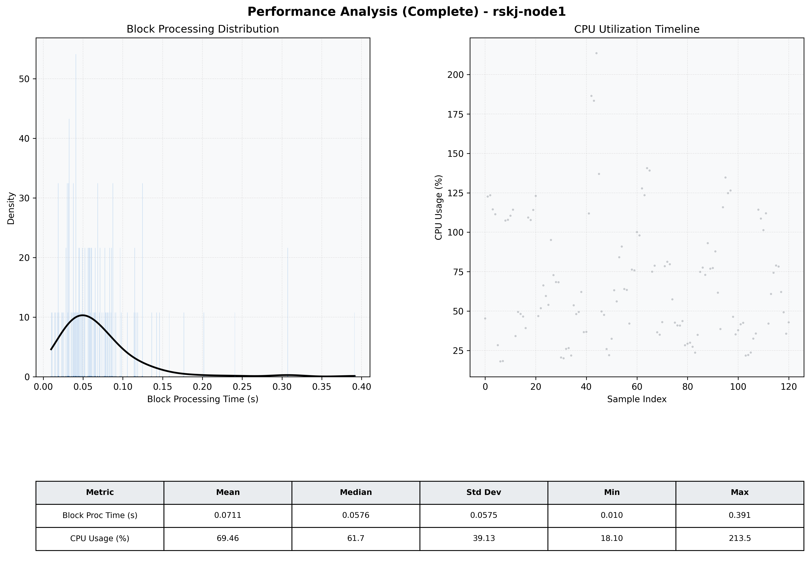

# Node1 Quantitative Performance Report

| Category | Metric | Unit | Mean | Median | Min | Max |
| :--- | :--- | :--- | :--- | :--- | :--- | :--- |
| Processing | Block Processing Time | s | 0.071 | 0.058 | 0.010 | 0.391 |
|  | BlockExecution JMX | s | 0.042 | 0.028 | 0.005 | 0.346 |
| | Gas Consumed (per block) | M units | 19.54 | 24.70 | 0.00 | 24.71 |
| Resources | CPU Usage per Container | % | 69.46 | 61.67 | 18.10 | 213.51 |
|  | Memory Usage per Container | MiB | 3984.3 | 3982.2 | 3889.4 | 4095.3 |
| | CPU & Memory Assigned | - | 1.0 CPU, 4G | - | - | - |
| JVM | JVM Heap Used | MiB | 2257.8 | 2257.3 | 1696.1 | 2732.4 |
| | JVM Heap Allocated | MiB | 2969.6 | 2969.6 | 2969.6 | 2969.6 |
| JVM GC | GC Copy Time | s | 0.0055 | 0.0048 | 0.000 | 0.017 |
| JVM GC | GC MarkSweep Time | s | 0.0125 | 0.0000 | 0.000 | 0.316 |
| Disk I/O | Disk Read | MiB/s | 388.829 | 76.966 | 0.000 | 9797.641 |
|  | Disk Write | MiB/s | 964.211 | 116.832 | 0.552 | 16058.621 |
| Network | Received Network Traffic per Container | KiB/s | 482.13 | 400.61 | 3.84 | 1917.06 |
|  | Sent Network Traffic per Container | KiB/s | 313.56 | 286.58 | 12.45 | 1255.59 |

