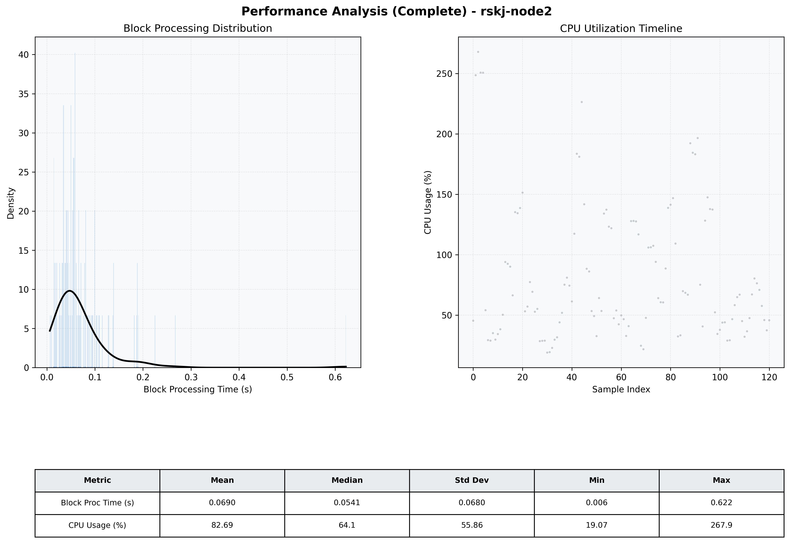

# Node2 Quantitative Performance Report

| Category | Metric | Unit | Mean | Median | Min | Max |
| :--- | :--- | :--- | :--- | :--- | :--- | :--- |
| Processing | Block Processing Time | s | 0.069 | 0.054 | 0.006 | 0.622 |
|  | BlockExecution JMX | s | 0.037 | 0.025 | 0.002 | 0.582 |
| | Gas Consumed (per block) | M units | 19.54 | 24.70 | 0.00 | 24.71 |
| Resources | CPU Usage per Container | % | 82.69 | 64.14 | 19.07 | 267.93 |
|  | Memory Usage per Container | MiB | 4807.5 | 4810.2 | 4637.5 | 4992.9 |
| | CPU & Memory Assigned | - | 4.0 CPU, 8G | - | - | - |
| JVM | JVM Heap Used | MiB | 2319.8 | 2294.9 | 1869.3 | 2896.6 |
| | JVM Heap Allocated | MiB | 3072.0 | 3072.0 | 3072.0 | 3072.0 |
| JVM GC | GC Copy Time | s | N/A | N/A | N/A | N/A |
| JVM GC | GC MarkSweep Time | s | N/A | N/A | N/A | N/A |
| Disk I/O | Disk Read | MiB/s | 0.032 | 0.000 | 0.000 | 3.586 |
|  | Disk Write | MiB/s | 963.006 | 111.594 | 0.552 | 16039.862 |
| Network | Received Network Traffic per Container | KiB/s | 469.43 | 400.49 | 3.82 | 1968.50 |
|  | Sent Network Traffic per Container | KiB/s | 327.30 | 285.99 | 11.92 | 1255.03 |

