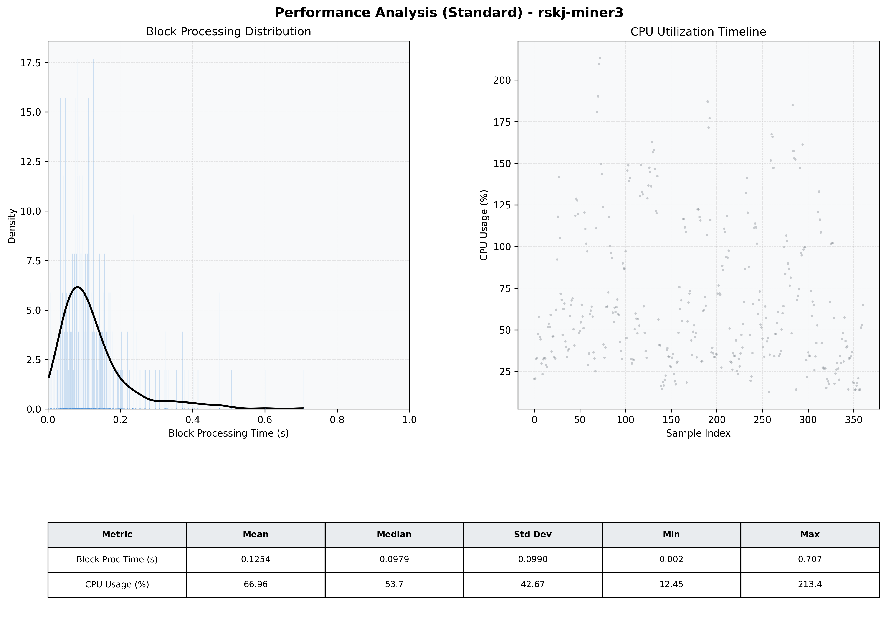

# Miner3 Quantitative Performance Report

| Category | Metric | Unit | Mean | Median | Min | Max |
| :--- | :--- | :--- | :--- | :--- | :--- | :--- |
| Processing | Block Processing Time | s | 0.125 | 0.098 | 0.002 | 0.707 |
|  | BlockExecution JMX | s | 0.087 | 0.062 | 0.003 | 0.627 |
| | Gas Consumed (per block) | M units | 18.81 | 24.70 | 0.00 | 24.85 |
| Resources | CPU Usage per Container | % | 66.96 | 53.68 | 12.45 | 213.38 |
|  | Memory Usage per Container | MiB | 4032.8 | 4032.2 | 3872.7 | 4095.8 |
| | CPU & Memory Assigned | - | 2.0 CPU, 4G | - | - | - |
| JVM | JVM Heap Used | MiB | 2306.2 | 2318.6 | 1358.1 | 2882.8 |
| | JVM Heap Allocated | MiB | 3072.0 | 3072.0 | 3072.0 | 3072.0 |
| JVM GC | GC Copy Time | s | N/A | N/A | N/A | N/A |
| JVM GC | GC MarkSweep Time | s | N/A | N/A | N/A | N/A |
| Disk I/O | Disk Read | MiB/s | 609.728 | 95.307 | 0.000 | 15940.276 |
|  | Disk Write | MiB/s | 794.676 | 108.555 | 0.000 | 20178.063 |
| Network | Received Network Traffic per Container | KiB/s | 421.14 | 345.85 | 3.43 | 1693.25 |
|  | Sent Network Traffic per Container | KiB/s | 394.52 | 305.59 | 11.84 | 1590.00 |

