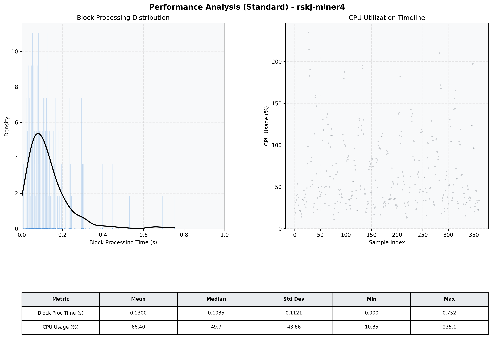

# Miner4 Quantitative Performance Report

| Category | Metric | Unit | Mean | Median | Min | Max |
| :--- | :--- | :--- | :--- | :--- | :--- | :--- |
| Processing | Block Processing Time | s | 0.130 | 0.104 | 0.000 | 0.752 |
|  | BlockExecution JMX | s | 0.093 | 0.068 | 0.005 | 0.727 |
| | Gas Consumed (per block) | M units | 18.81 | 24.70 | 0.00 | 24.85 |
| Resources | CPU Usage per Container | % | 66.40 | 49.66 | 10.85 | 235.08 |
|  | Memory Usage per Container | MiB | 4012.3 | 4024.4 | 3716.8 | 4096.0 |
| | CPU & Memory Assigned | - | 1.0 CPU, 4G | - | - | - |
| JVM | JVM Heap Used | MiB | 2286.8 | 2288.5 | 1451.4 | 2937.8 |
| | JVM Heap Allocated | MiB | 2969.6 | 2969.6 | 2969.6 | 2969.6 |
| JVM GC | GC Copy Time | s | 0.0054 | 0.0038 | 0.000 | 0.048 |
| JVM GC | GC MarkSweep Time | s | 0.0167 | 0.0000 | 0.000 | 0.347 |
| Disk I/O | Disk Read | MiB/s | 520.226 | 69.103 | 0.000 | 15558.360 |
|  | Disk Write | MiB/s | 795.062 | 109.797 | 0.552 | 19006.793 |
| Network | Received Network Traffic per Container | KiB/s | 434.59 | 362.77 | 3.46 | 1650.89 |
|  | Sent Network Traffic per Container | KiB/s | 356.58 | 268.87 | 5.18 | 1822.90 |

