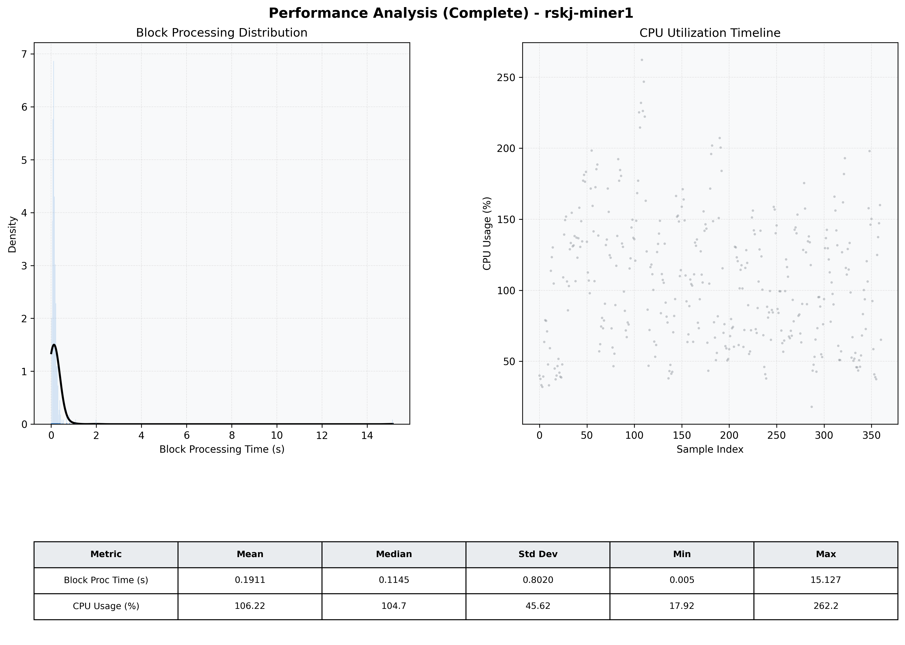

# Miner1 Quantitative Performance Report

| Category | Metric | Unit | Mean | Median | Min | Max |
| :--- | :--- | :--- | :--- | :--- | :--- | :--- |
| Processing | Block Processing Time | s | 0.191 | 0.114 | 0.005 | 15.127 |
|  | BlockExecution JMX | s | 0.152 | 0.078 | 0.007 | 15.077 |
| | Gas Consumed (per block) | M units | 18.81 | 24.70 | 0.00 | 24.85 |
| Resources | CPU Usage per Container | % | 106.22 | 104.73 | 17.92 | 262.22 |
|  | Memory Usage per Container | MiB | 4022.9 | 4025.1 | 3829.1 | 4095.9 |
| | CPU & Memory Assigned | - | 1.0 CPU, 4G | - | - | - |
| JVM | JVM Heap Used | MiB | 2282.2 | 2284.4 | 1496.2 | 2842.3 |
| | JVM Heap Allocated | MiB | 2969.6 | 2969.6 | 2969.6 | 2969.6 |
| JVM GC | GC Copy Time | s | 0.0083 | 0.0073 | 0.000 | 0.031 |
| JVM GC | GC MarkSweep Time | s | 0.0116 | 0.0000 | 0.000 | 0.330 |
| Disk I/O | Disk Read | MiB/s | 568.348 | 80.276 | 0.000 | 15733.940 |
|  | Disk Write | MiB/s | 923.373 | 217.640 | 0.000 | 19489.517 |
| Network | Received Network Traffic per Container | KiB/s | 1241.80 | 1250.50 | 4.11 | 2792.67 |
|  | Sent Network Traffic per Container | KiB/s | 565.43 | 476.05 | 12.77 | 2089.29 |

