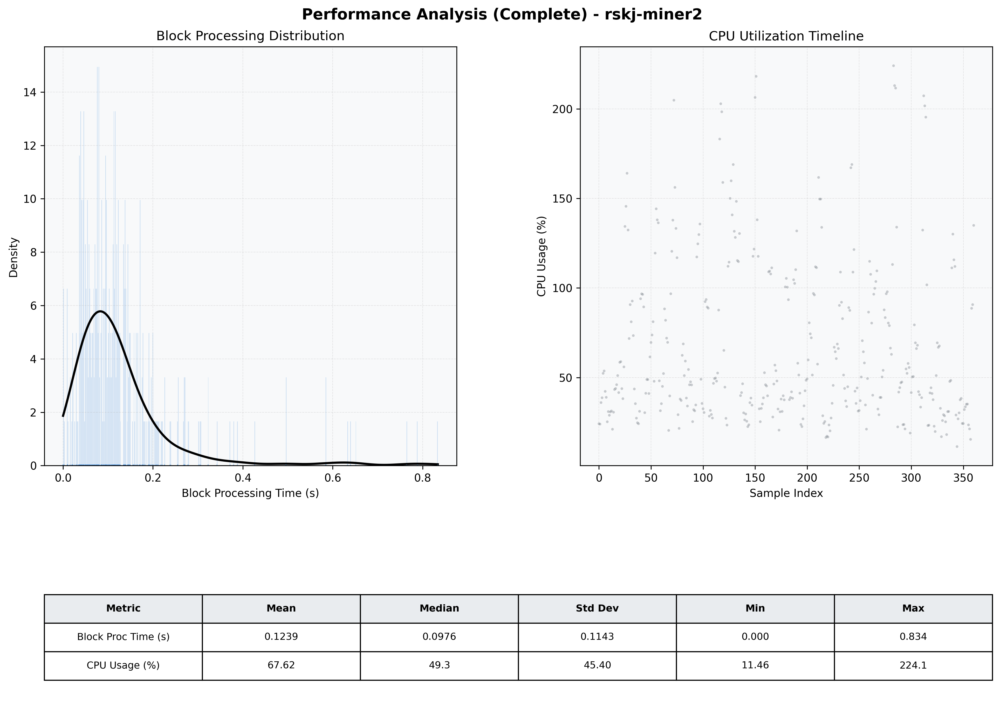

# Miner2 Quantitative Performance Report

| Category | Metric | Unit | Mean | Median | Min | Max |
| :--- | :--- | :--- | :--- | :--- | :--- | :--- |
| Processing | Block Processing Time | s | 0.124 | 0.098 | 0.000 | 0.834 |
|  | BlockExecution JMX | s | 0.090 | 0.066 | 0.003 | 0.712 |
| | Gas Consumed (per block) | M units | 18.81 | 24.70 | 0.00 | 24.85 |
| Resources | CPU Usage per Container | % | 67.62 | 49.28 | 11.46 | 224.07 |
|  | Memory Usage per Container | MiB | 3989.9 | 4002.0 | 3684.5 | 4095.9 |
| | CPU & Memory Assigned | - | 1.0 CPU, 4G | - | - | - |
| JVM | JVM Heap Used | MiB | 2280.5 | 2279.0 | 1554.0 | 2839.5 |
| | JVM Heap Allocated | MiB | 2969.6 | 2969.6 | 2969.6 | 2969.6 |
| JVM GC | GC Copy Time | s | 0.0055 | 0.0043 | 0.000 | 0.040 |
| JVM GC | GC MarkSweep Time | s | 0.0131 | 0.0000 | 0.000 | 0.433 |
| Disk I/O | Disk Read | MiB/s | 436.464 | 63.310 | 0.000 | 15202.372 |
|  | Disk Write | MiB/s | 791.335 | 110.207 | 0.000 | 19001.138 |
| Network | Received Network Traffic per Container | KiB/s | 422.94 | 329.22 | 3.41 | 1753.51 |
|  | Sent Network Traffic per Container | KiB/s | 403.39 | 321.22 | 6.38 | 1552.48 |

