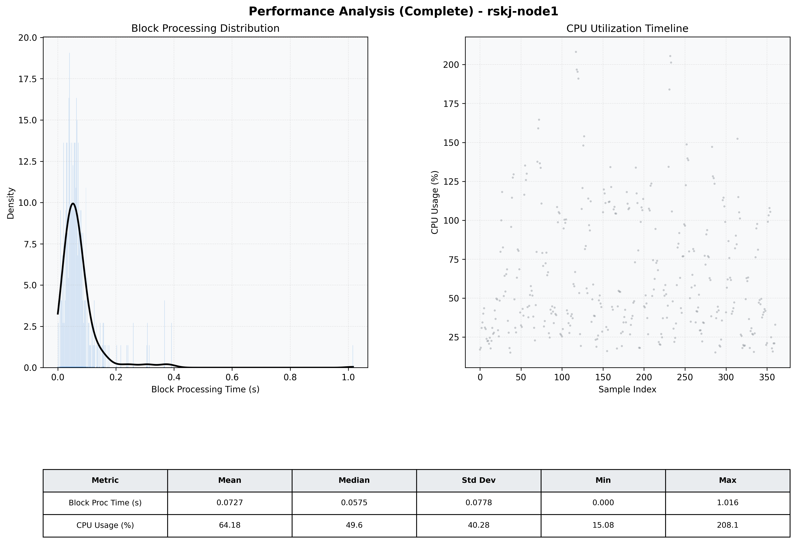

# Node1 Quantitative Performance Report

| Category | Metric | Unit | Mean | Median | Min | Max |
| :--- | :--- | :--- | :--- | :--- | :--- | :--- |
| Processing | Block Processing Time | s | 0.073 | 0.057 | 0.000 | 1.016 |
|  | BlockExecution JMX | s | 0.055 | 0.029 | 0.002 | 1.509 |
| | Gas Consumed (per block) | M units | 18.81 | 24.70 | 0.00 | 24.85 |
| Resources | CPU Usage per Container | % | 64.18 | 49.60 | 15.08 | 208.12 |
|  | Memory Usage per Container | MiB | 3946.9 | 3972.0 | 3470.7 | 4095.4 |
| | CPU & Memory Assigned | - | 1.0 CPU, 4G | - | - | - |
| JVM | JVM Heap Used | MiB | 2246.6 | 2231.4 | 1446.1 | 2871.1 |
| | JVM Heap Allocated | MiB | 2969.6 | 2969.6 | 2969.6 | 2969.6 |
| JVM GC | GC Copy Time | s | 0.0057 | 0.0048 | 0.000 | 0.024 |
| JVM GC | GC MarkSweep Time | s | 0.0105 | 0.0000 | 0.000 | 0.446 |
| Disk I/O | Disk Read | MiB/s | 313.621 | 48.550 | 0.000 | 13068.000 |
|  | Disk Write | MiB/s | 790.452 | 106.908 | 0.000 | 18997.552 |
| Network | Received Network Traffic per Container | KiB/s | 450.15 | 365.66 | 3.44 | 2413.84 |
|  | Sent Network Traffic per Container | KiB/s | 284.92 | 219.65 | 6.71 | 1255.61 |

