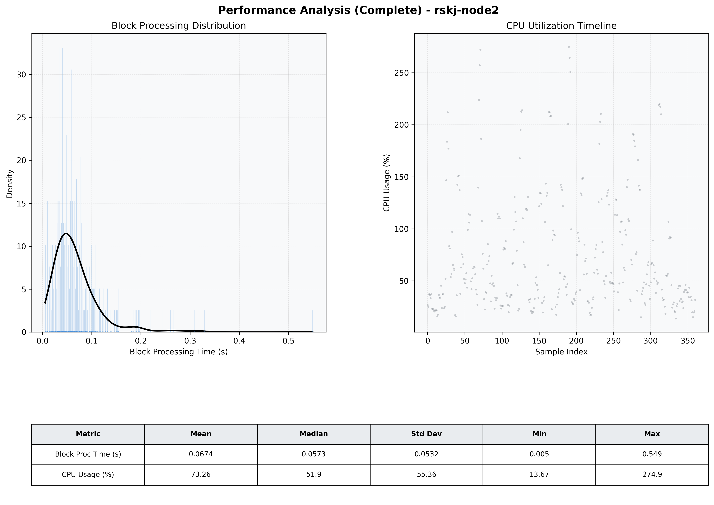

# Node2 Quantitative Performance Report

| Category | Metric | Unit | Mean | Median | Min | Max |
| :--- | :--- | :--- | :--- | :--- | :--- | :--- |
| Processing | Block Processing Time | s | 0.067 | 0.057 | 0.005 | 0.549 |
|  | BlockExecution JMX | s | 0.035 | 0.027 | 0.002 | 0.431 |
| | Gas Consumed (per block) | M units | 18.81 | 24.70 | 0.00 | 24.85 |
| Resources | CPU Usage per Container | % | 73.26 | 51.91 | 13.67 | 274.90 |
|  | Memory Usage per Container | MiB | 4648.0 | 4621.1 | 4191.7 | 5237.5 |
| | CPU & Memory Assigned | - | 4.0 CPU, 8G | - | - | - |
| JVM | JVM Heap Used | MiB | 2247.6 | 2271.9 | 1366.9 | 2835.8 |
| | JVM Heap Allocated | MiB | 3072.0 | 3072.0 | 3072.0 | 3072.0 |
| JVM GC | GC Copy Time | s | N/A | N/A | N/A | N/A |
| JVM GC | GC MarkSweep Time | s | N/A | N/A | N/A | N/A |
| Disk I/O | Disk Read | MiB/s | 0.014 | 0.000 | 0.000 | 3.586 |
|  | Disk Write | MiB/s | 777.902 | 108.406 | 0.000 | 18939.899 |
| Network | Received Network Traffic per Container | KiB/s | 441.50 | 365.30 | 3.57 | 1800.94 |
|  | Sent Network Traffic per Container | KiB/s | 301.80 | 220.10 | 11.80 | 1254.85 |

