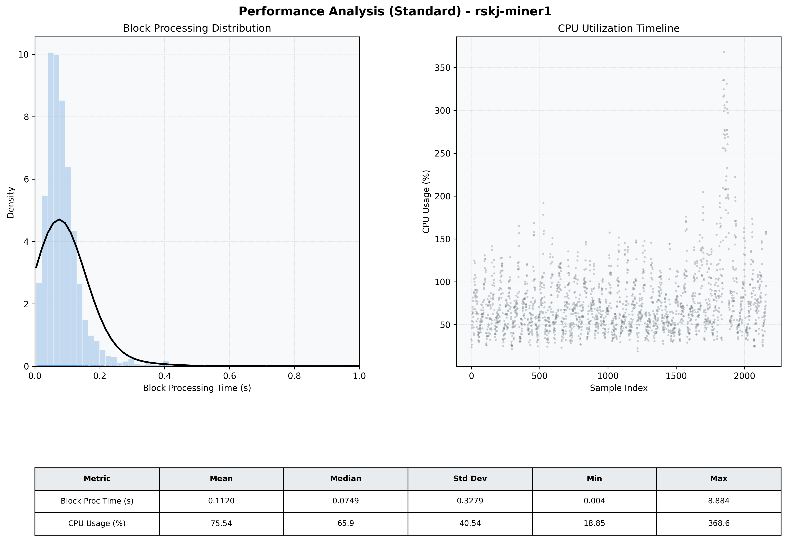

# Miner1 Quantitative Performance Report

| Category | Metric | Unit | Mean | Median | Min | Max |
| :--- | :--- | :--- | :--- | :--- | :--- | :--- |
| Processing | Block Processing Time | s | 0.112 | 0.075 | 0.004 | 8.884 |
|  | BlockExecution JMX | s | 0.066 | 0.054 | 0.003 | 0.806 |
| | Gas Consumed (per block) | M units | 4.68 | 6.86 | 0.00 | 6.99 |
| Resources | CPU Usage per Container | % | 75.54 | 65.92 | 18.85 | 368.56 |
|  | Memory Usage per Container | MiB | 4049.3 | 4062.9 | 3653.7 | 4096.0 |
| JVM | JVM Heap Used | MiB | 1864.7 | 1878.3 | 760.1 | 2884.2 |
| | JVM Heap Allocated | MiB | 2969.6 | 2969.6 | 2969.6 | 2969.6 |
| JVM GC | GC Copy Time | s | 0.0038 | 0.0026 | 0.000 | 0.131 |
| JVM GC | GC MarkSweep Time | s | 0.0008 | 0.0000 | 0.000 | 0.175 |
| Disk I/O | Disk Read | MiB/s | 758.934 | 84.270 | 0.000 | 105903.448 |
|  | Disk Write | MiB/s | 569.939 | 112.824 | 0.000 | 56656.966 |
| Network | Received Network Traffic per Container | KiB/s | 968.31 | 1103.41 | 5.65 | 1522.74 |
|  | Sent Network Traffic per Container | KiB/s | 323.68 | 228.08 | 15.00 | 5595.96 |

