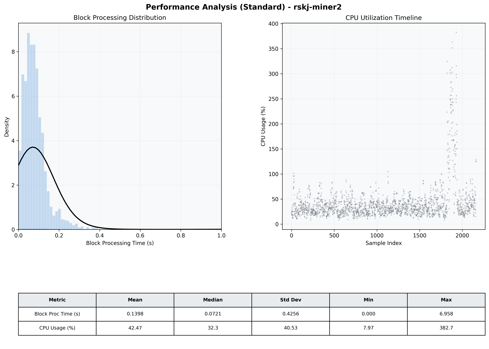

# Miner2 Quantitative Performance Report

| Category | Metric | Unit | Mean | Median | Min | Max |
| :--- | :--- | :--- | :--- | :--- | :--- | :--- |
| Processing | Block Processing Time | s | 0.140 | 0.072 | 0.000 | 6.958 |
|  | BlockExecution JMX | s | 0.060 | 0.050 | 0.003 | 0.862 |
| | Gas Consumed (per block) | M units | 4.68 | 6.86 | 0.00 | 6.99 |
| Resources | CPU Usage per Container | % | 42.47 | 32.27 | 7.97 | 382.65 |
|  | Memory Usage per Container | MiB | 4069.5 | 4085.2 | 3952.6 | 4096.0 |
| JVM | JVM Heap Used | MiB | 1745.6 | 1760.0 | 485.4 | 2902.0 |
| | JVM Heap Allocated | MiB | 2969.6 | 2969.6 | 2969.6 | 2969.6 |
| JVM GC | GC Copy Time | s | 0.0036 | 0.0013 | 0.000 | 0.143 |
| JVM GC | GC MarkSweep Time | s | 0.0009 | 0.0000 | 0.000 | 0.088 |
| Disk I/O | Disk Read | MiB/s | 0.001 | 0.000 | 0.000 | 0.113 |
|  | Disk Write | MiB/s | 412.446 | 24.281 | 0.000 | 37977.449 |
| Network | Received Network Traffic per Container | KiB/s | 199.11 | 125.55 | 1.26 | 1539.93 |
|  | Sent Network Traffic per Container | KiB/s | 291.63 | 138.35 | 9.82 | 7535.32 |

