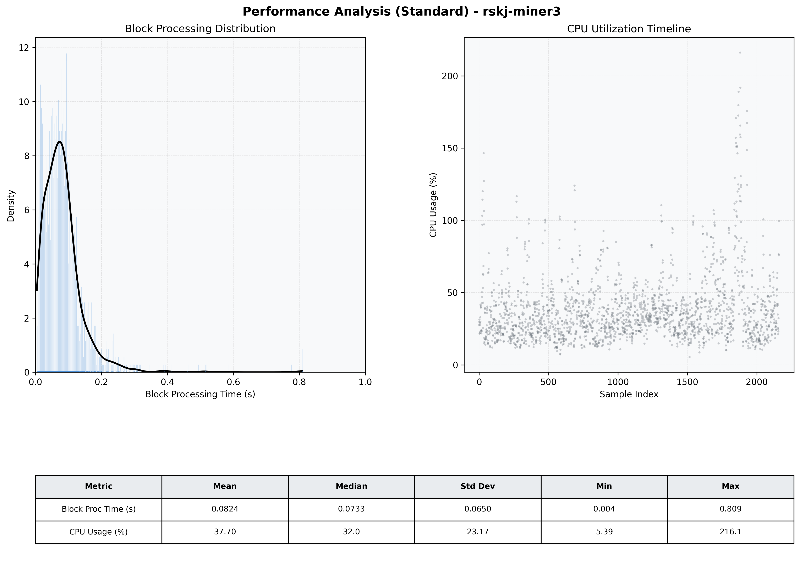

# Miner3 Quantitative Performance Report

| Category | Metric | Unit | Mean | Median | Min | Max |
| :--- | :--- | :--- | :--- | :--- | :--- | :--- |
| Processing | Block Processing Time | s | 0.082 | 0.073 | 0.004 | 0.809 |
|  | BlockExecution JMX | s | 0.059 | 0.049 | 0.002 | 0.729 |
| | Gas Consumed (per block) | M units | 4.68 | 6.86 | 0.00 | 6.99 |
| Resources | CPU Usage per Container | % | 37.70 | 32.01 | 5.39 | 216.10 |
|  | Memory Usage per Container | MiB | 4032.3 | 4038.6 | 3736.7 | 4096.0 |
| JVM | JVM Heap Used | MiB | 1672.4 | 1642.5 | 791.1 | 2656.2 |
| | JVM Heap Allocated | MiB | 3072.0 | 3072.0 | 3072.0 | 3072.0 |
| JVM GC | GC Copy Time | s | N/A | N/A | N/A | N/A |
| JVM GC | GC MarkSweep Time | s | N/A | N/A | N/A | N/A |
| Disk I/O | Disk Read | MiB/s | 369.804 | 68.138 | 0.000 | 33321.196 |
|  | Disk Write | MiB/s | 387.782 | 25.379 | 0.000 | 45243.543 |
| Network | Received Network Traffic per Container | KiB/s | 168.90 | 107.72 | 1.16 | 1265.75 |
|  | Sent Network Traffic per Container | KiB/s | 149.44 | 90.28 | 9.20 | 1044.62 |

