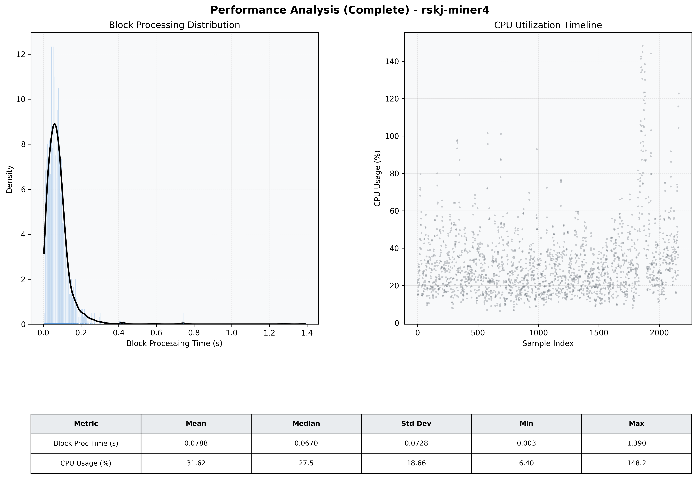

# Miner4 Quantitative Performance Report

| Category | Metric | Unit | Mean | Median | Min | Max |
| :--- | :--- | :--- | :--- | :--- | :--- | :--- |
| Processing | Block Processing Time | s | 0.079 | 0.067 | 0.003 | 1.390 |
|  | BlockExecution JMX | s | 0.056 | 0.046 | 0.002 | 1.191 |
| | Gas Consumed (per block) | M units | 4.68 | 6.86 | 0.00 | 6.99 |
| Resources | CPU Usage per Container | % | 31.62 | 27.45 | 6.40 | 148.22 |
|  | Memory Usage per Container | MiB | 3993.8 | 4018.6 | 3383.8 | 4096.0 |
| JVM | JVM Heap Used | MiB | 1793.4 | 1796.8 | 713.2 | 2889.3 |
| | JVM Heap Allocated | MiB | 2969.6 | 2969.6 | 2969.6 | 2969.6 |
| JVM GC | GC Copy Time | s | 0.0013 | 0.0012 | 0.000 | 0.014 |
| JVM GC | GC MarkSweep Time | s | 0.0002 | 0.0000 | 0.000 | 0.101 |
| Disk I/O | Disk Read | MiB/s | 384.166 | 64.966 | 0.000 | 37644.690 |
|  | Disk Write | MiB/s | 413.416 | 25.380 | 0.000 | 43128.828 |
| Network | Received Network Traffic per Container | KiB/s | 168.26 | 107.55 | 1.15 | 1274.54 |
|  | Sent Network Traffic per Container | KiB/s | 152.61 | 99.33 | 9.72 | 1001.59 |

