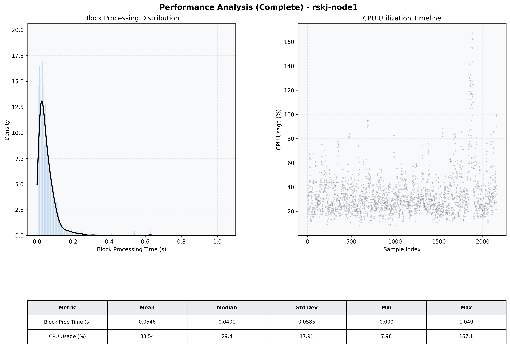

# Node1 Quantitative Performance Report

| Category | Metric | Unit | Mean | Median | Min | Max |
| :--- | :--- | :--- | :--- | :--- | :--- | :--- |
| Processing | Block Processing Time | s | 0.055 | 0.040 | 0.000 | 1.049 |
|  | BlockExecution JMX | s | 0.031 | 0.020 | 0.002 | 0.935 |
| | Gas Consumed (per block) | M units | 4.68 | 6.86 | 0.00 | 6.99 |
| Resources | CPU Usage per Container | % | 33.54 | 29.35 | 7.98 | 167.05 |
|  | Memory Usage per Container | MiB | 4016.4 | 4026.9 | 3809.6 | 4096.0 |
| JVM | JVM Heap Used | MiB | 1813.1 | 1825.6 | 654.5 | 2885.3 |
| | JVM Heap Allocated | MiB | 2969.6 | 2969.6 | 2969.6 | 2969.6 |
| JVM GC | GC Copy Time | s | 0.0016 | 0.0015 | 0.000 | 0.013 |
| JVM GC | GC MarkSweep Time | s | 0.0003 | 0.0000 | 0.000 | 0.216 |
| Disk I/O | Disk Read | MiB/s | 380.525 | 67.175 | 0.000 | 36583.842 |
|  | Disk Write | MiB/s | 411.396 | 22.206 | 0.552 | 37959.381 |
| Network | Received Network Traffic per Container | KiB/s | 179.64 | 121.63 | 6.70 | 1280.20 |
|  | Sent Network Traffic per Container | KiB/s | 158.27 | 102.48 | 24.25 | 1034.94 |

