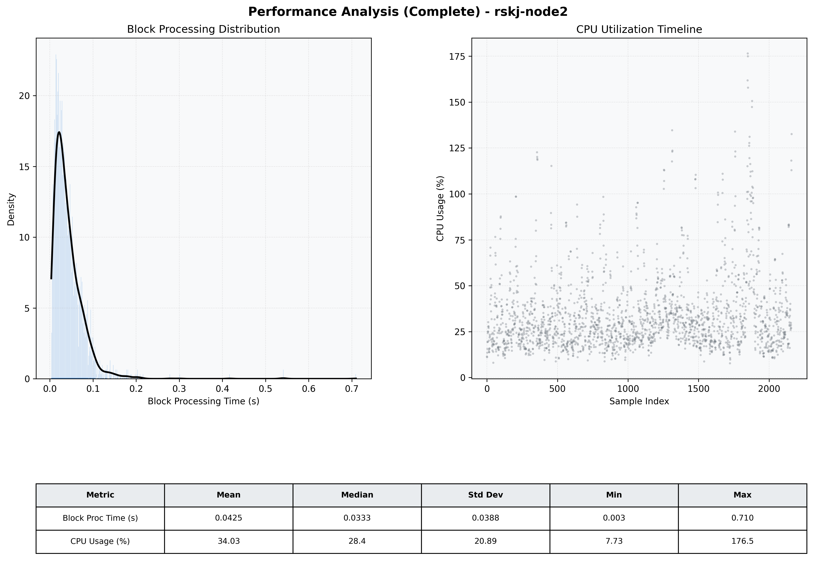

# Node2 Quantitative Performance Report

| Category | Metric | Unit | Mean | Median | Min | Max |
| :--- | :--- | :--- | :--- | :--- | :--- | :--- |
| Processing | Block Processing Time | s | 0.043 | 0.033 | 0.003 | 0.710 |
|  | BlockExecution JMX | s | 0.022 | 0.016 | 0.002 | 0.509 |
| | Gas Consumed (per block) | M units | 4.68 | 6.86 | 0.00 | 6.99 |
| Resources | CPU Usage per Container | % | 34.03 | 28.38 | 7.73 | 176.48 |
|  | Memory Usage per Container | MiB | 5809.0 | 5537.6 | 4190.1 | 7460.0 |
| JVM | JVM Heap Used | MiB | 1661.0 | 1652.2 | 744.5 | 2615.1 |
| | JVM Heap Allocated | MiB | 3072.0 | 3072.0 | 3072.0 | 3072.0 |
| JVM GC | GC Copy Time | s | N/A | N/A | N/A | N/A |
| JVM GC | GC MarkSweep Time | s | N/A | N/A | N/A | N/A |
| Disk I/O | Disk Read | MiB/s | 190.399 | 30.481 | 0.000 | 28693.403 |
|  | Disk Write | MiB/s | 393.822 | 22.344 | 0.000 | 37507.068 |
| Network | Received Network Traffic per Container | KiB/s | 173.82 | 115.96 | 1.16 | 1274.37 |
|  | Sent Network Traffic per Container | KiB/s | 124.16 | 68.16 | 9.02 | 1000.25 |

