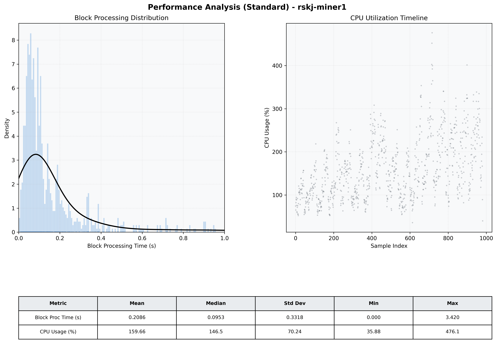

# Miner1 Quantitative Performance Report

| Category | Metric | Unit | Mean | Median | Min | Max |
| :--- | :--- | :--- | :--- | :--- | :--- | :--- |
| Processing | Block Processing Time | s | 0.209 | 0.095 | 0.000 | 3.420 |
|  | BlockExecution JMX | s | 0.122 | 0.070 | 0.004 | 0.980 |
| | Gas Consumed (per block) | M units | 4.53 | 6.72 | 0.00 | 6.99 |
| Resources | CPU Usage per Container | % | 159.66 | 146.48 | 35.88 | 476.09 |
|  | Memory Usage per Container | MiB | 4057.3 | 4090.4 | 3848.8 | 4096.0 |
| JVM | JVM Heap Used | MiB | 2417.8 | 2437.5 | 1382.7 | 2968.2 |
| | JVM Heap Allocated | MiB | 2969.6 | 2969.6 | 2969.6 | 2969.6 |
| JVM GC | GC Copy Time | s | 0.0020 | 0.0018 | 0.000 | 0.011 |
| JVM GC | GC MarkSweep Time | s | 0.0290 | 0.0000 | 0.000 | 0.180 |
| Disk I/O | Disk Read | MiB/s | 476.482 | 90.345 | 0.000 | 27844.217 |
|  | Disk Write | MiB/s | 556.245 | 128.966 | 0.000 | 29278.389 |
| Network | Received Network Traffic per Container | KiB/s | 903.51 | 997.01 | 11.52 | 1447.39 |
|  | Sent Network Traffic per Container | KiB/s | 640.96 | 588.31 | 241.76 | 1501.41 |

