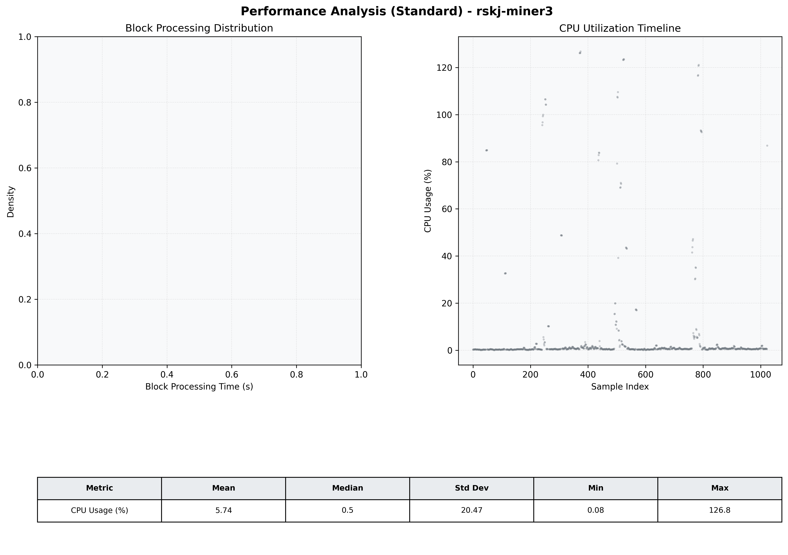

# Miner3 Quantitative Performance Report

| Category | Metric | Unit | Mean | Median | Min | Max |
| :--- | :--- | :--- | :--- | :--- | :--- | :--- |
| Processing | Block Processing Time | s | N/A | N/A | N/A | N/A |
|  | BlockExecution JMX | s | N/A | N/A | N/A | N/A |
| | Gas Consumed (per block) | M units | 4.53 | 6.72 | 0.00 | 6.99 |
| Resources | CPU Usage per Container | % | 5.74 | 0.52 | 0.08 | 126.78 |
|  | Memory Usage per Container | MiB | 3914.9 | 3893.3 | 3883.7 | 4095.2 |
| JVM | JVM Heap Used | MiB | N/A | N/A | N/A | N/A |
| | JVM Heap Allocated | MiB | N/A | N/A | N/A | N/A |
| JVM GC | GC Copy Time | s | N/A | N/A | N/A | N/A |
| JVM GC | GC MarkSweep Time | s | N/A | N/A | N/A | N/A |
| Disk I/O | Disk Read | MiB/s | 1.915 | 0.000 | 0.000 | 1821.304 |
|  | Disk Write | MiB/s | 1.721 | 0.276 | 0.000 | 608.159 |
| Network | Received Network Traffic per Container | KiB/s | 861.59 | 861.98 | 445.82 | 981.35 |
|  | Sent Network Traffic per Container | KiB/s | 15.74 | 17.48 | 0.00 | 47.90 |

