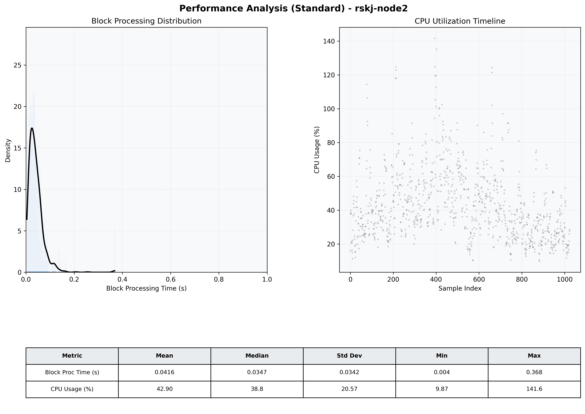

# Node2 Quantitative Performance Report

| Category | Metric | Unit | Mean | Median | Min | Max |
| :--- | :--- | :--- | :--- | :--- | :--- | :--- |
| Processing | Block Processing Time | s | 0.042 | 0.035 | 0.004 | 0.368 |
|  | BlockExecution JMX | s | 0.019 | 0.015 | 0.002 | 0.189 |
| | Gas Consumed (per block) | M units | 4.53 | 6.72 | 0.00 | 6.99 |
| Resources | CPU Usage per Container | % | 42.90 | 38.78 | 9.87 | 141.61 |
|  | Memory Usage per Container | MiB | 4772.9 | 5037.9 | 1017.7 | 5742.8 |
| JVM | JVM Heap Used | MiB | 1804.5 | 1893.4 | 331.9 | 2720.6 |
| | JVM Heap Allocated | MiB | 3072.0 | 3072.0 | 3072.0 | 3072.0 |
| JVM GC | GC Copy Time | s | N/A | N/A | N/A | N/A |
| JVM GC | GC MarkSweep Time | s | N/A | N/A | N/A | N/A |
| Disk I/O | Disk Read | MiB/s | 94.286 | 22.484 | 0.000 | 12613.496 |
|  | Disk Write | MiB/s | 316.929 | 19.447 | 0.552 | 26675.585 |
| Network | Received Network Traffic per Container | KiB/s | 131.67 | 82.12 | 0.57 | 938.12 |
|  | Sent Network Traffic per Container | KiB/s | 88.64 | 52.55 | 4.79 | 700.08 |

