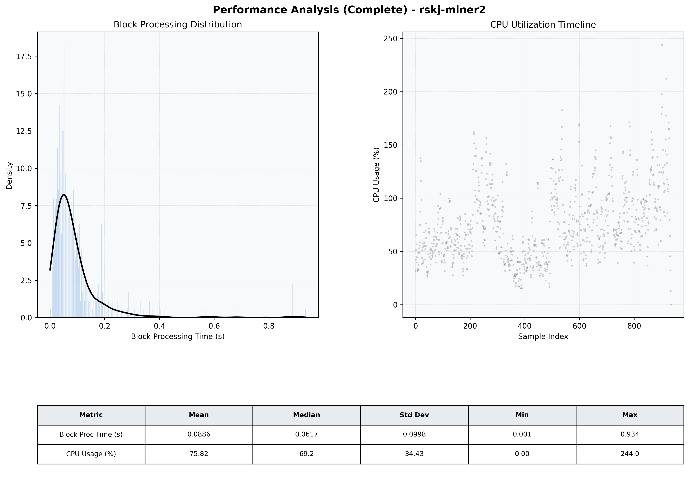

# Miner2 Quantitative Performance Report

| Category | Metric | Unit | Mean | Median | Min | Max |
| :--- | :--- | :--- | :--- | :--- | :--- | :--- |
| Processing | Block Processing Time | s | 0.089 | 0.062 | 0.001 | 0.934 |
|  | BlockExecution JMX | s | 0.063 | 0.042 | 0.004 | 0.823 |
| | Gas Consumed (per block) | M units | 4.53 | 6.72 | 0.00 | 6.99 |
| Resources | CPU Usage per Container | % | 75.82 | 69.25 | 0.00 | 243.96 |
|  | Memory Usage per Container | MiB | 3915.3 | 3933.4 | 3510.1 | 4096.0 |
| JVM | JVM Heap Used | MiB | 2012.6 | 2035.0 | 729.9 | 2966.3 |
| | JVM Heap Allocated | MiB | 2969.6 | 2969.6 | 2969.6 | 2969.6 |
| JVM GC | GC Copy Time | s | 0.0010 | 0.0009 | 0.000 | 0.009 |
| JVM GC | GC MarkSweep Time | s | 0.0035 | 0.0000 | 0.000 | 0.065 |
| Disk I/O | Disk Read | MiB/s | 222.673 | 38.077 | 0.000 | 24705.842 |
|  | Disk Write | MiB/s | 361.150 | 23.311 | 0.000 | 39156.080 |
| Network | Received Network Traffic per Container | KiB/s | 139.62 | 92.07 | 0.00 | 936.34 |
|  | Sent Network Traffic per Container | KiB/s | 474.70 | 488.50 | 0.00 | 1166.45 |

