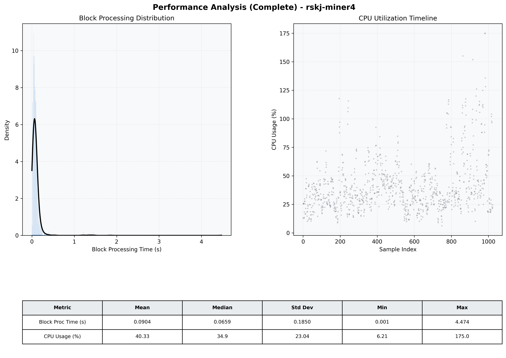

# Miner4 Quantitative Performance Report

| Category | Metric | Unit | Mean | Median | Min | Max |
| :--- | :--- | :--- | :--- | :--- | :--- | :--- |
| Processing | Block Processing Time | s | 0.090 | 0.066 | 0.001 | 4.474 |
|  | BlockExecution JMX | s | 0.067 | 0.041 | 0.004 | 4.324 |
| | Gas Consumed (per block) | M units | 4.53 | 6.72 | 0.00 | 6.99 |
| Resources | CPU Usage per Container | % | 40.33 | 34.87 | 6.21 | 174.96 |
|  | Memory Usage per Container | MiB | 3909.2 | 3945.3 | 3557.4 | 4095.9 |
| JVM | JVM Heap Used | MiB | 1991.0 | 2020.9 | 643.0 | 2956.6 |
| | JVM Heap Allocated | MiB | 2969.6 | 2969.6 | 2969.6 | 2969.6 |
| JVM GC | GC Copy Time | s | 0.0010 | 0.0011 | 0.000 | 0.005 |
| JVM GC | GC MarkSweep Time | s | 0.0063 | 0.0000 | 0.000 | 0.093 |
| Disk I/O | Disk Read | MiB/s | 216.435 | 37.794 | 0.000 | 24700.390 |
|  | Disk Write | MiB/s | 349.234 | 21.792 | 0.000 | 30282.916 |
| Network | Received Network Traffic per Container | KiB/s | 125.23 | 79.39 | 0.63 | 929.42 |
|  | Sent Network Traffic per Container | KiB/s | 114.70 | 72.13 | 5.46 | 735.51 |

