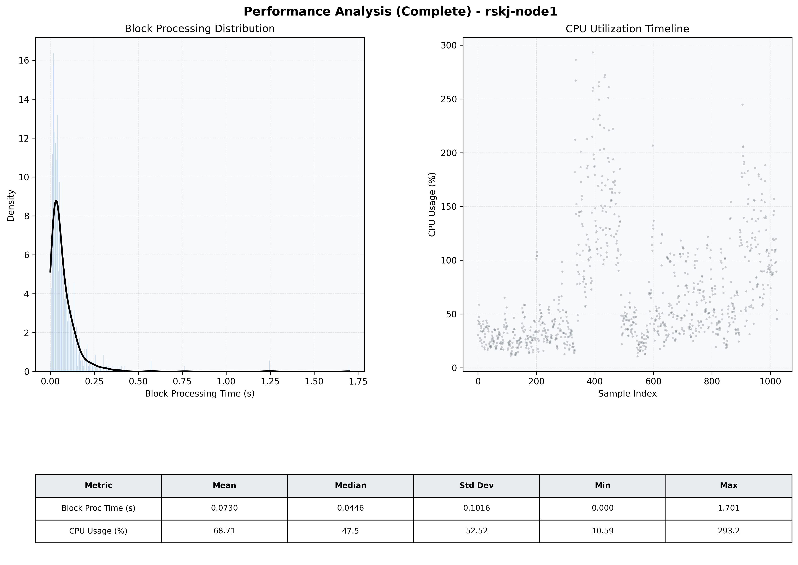

# Node1 Quantitative Performance Report

| Category | Metric | Unit | Mean | Median | Min | Max |
| :--- | :--- | :--- | :--- | :--- | :--- | :--- |
| Processing | Block Processing Time | s | 0.073 | 0.045 | 0.000 | 1.701 |
|  | BlockExecution JMX | s | 0.043 | 0.022 | 0.002 | 1.550 |
| | Gas Consumed (per block) | M units | 4.53 | 6.72 | 0.00 | 6.99 |
| Resources | CPU Usage per Container | % | 68.71 | 47.51 | 10.59 | 293.19 |
|  | Memory Usage per Container | MiB | 3922.1 | 3920.0 | 3562.1 | 4095.9 |
| JVM | JVM Heap Used | MiB | 2306.3 | 2390.8 | 1047.2 | 2969.4 |
| | JVM Heap Allocated | MiB | 2969.6 | 2969.6 | 2969.6 | 2969.6 |
| JVM GC | GC Copy Time | s | 0.0008 | 0.0000 | 0.000 | 0.007 |
| JVM GC | GC MarkSweep Time | s | 0.0153 | 0.0000 | 0.000 | 0.137 |
| Disk I/O | Disk Read | MiB/s | 255.549 | 48.000 | 0.000 | 22394.152 |
|  | Disk Write | MiB/s | 447.429 | 19.586 | 0.000 | 103589.959 |
| Network | Received Network Traffic per Container | KiB/s | 138.69 | 88.21 | 0.57 | 938.12 |
|  | Sent Network Traffic per Container | KiB/s | 190.18 | 96.66 | 4.75 | 1012.82 |

