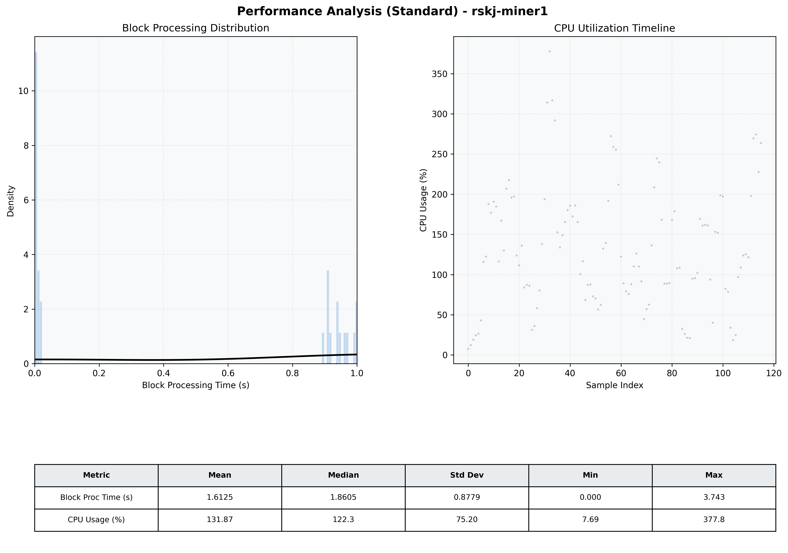

# Miner1 Quantitative Performance Report

| Category | Metric | Unit | Mean | Median | Min | Max |
| :--- | :--- | :--- | :--- | :--- | :--- | :--- |
| Processing | Block Processing Time | s | 1.612 | 1.861 | 0.000 | 3.743 |
|  | BlockExecution JMX | s | 0.751 | 0.924 | 0.002 | 1.000 |
| | Gas Consumed (per block) | M units | 7.30 | 10.00 | 0.00 | 10.00 |
| Resources | CPU Usage per Container | % | 131.87 | 122.34 | 7.69 | 377.79 |
|  | Memory Usage per Container | MiB | 1177.7 | 1191.8 | 564.5 | 1282.0 |
| JVM | JVM Heap Used | MiB | 444.2 | 438.5 | 21.3 | 841.2 |
| | JVM Heap Allocated | MiB | 2969.6 | 2969.6 | 2969.6 | 2969.6 |
| JVM GC | GC Copy Time | s | 0.0019 | 0.0017 | 0.000 | 0.004 |
| JVM GC | GC MarkSweep Time | s | 0.0000 | 0.0000 | 0.000 | 0.000 |
| Disk I/O | Disk Read | MiB/s | 0.000 | 0.000 | 0.000 | 0.000 |
|  | Disk Write | MiB/s | 136.718 | 75.516 | 1.793 | 615.703 |
| Network | Received Network Traffic per Container | KiB/s | 33.74 | 19.41 | 1.28 | 126.52 |
|  | Sent Network Traffic per Container | KiB/s | 33.79 | 25.00 | 8.62 | 95.40 |

