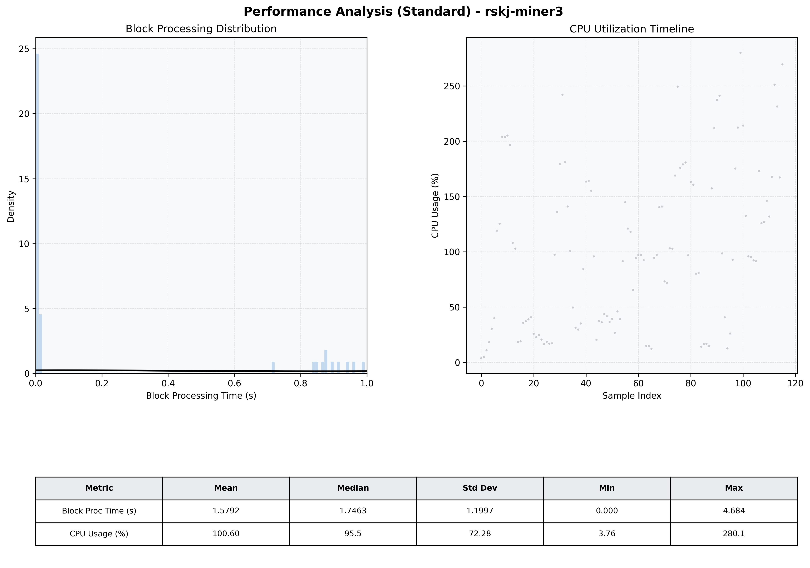

# Miner3 Quantitative Performance Report

| Category | Metric | Unit | Mean | Median | Min | Max |
| :--- | :--- | :--- | :--- | :--- | :--- | :--- |
| Processing | Block Processing Time | s | 1.579 | 1.746 | 0.000 | 4.684 |
|  | BlockExecution JMX | s | 0.533 | 0.841 | 0.002 | 0.997 |
| | Gas Consumed (per block) | M units | 7.30 | 10.00 | 0.00 | 10.00 |
| Resources | CPU Usage per Container | % | 100.60 | 95.54 | 3.76 | 280.07 |
|  | Memory Usage per Container | MiB | 2254.0 | 2342.4 | 472.9 | 2371.4 |
| JVM | JVM Heap Used | MiB | 909.5 | 939.7 | 30.0 | 1835.4 |
| | JVM Heap Allocated | MiB | 3072.0 | 3072.0 | 3072.0 | 3072.0 |
| JVM GC | GC Copy Time | s | N/A | N/A | N/A | N/A |
| JVM GC | GC MarkSweep Time | s | N/A | N/A | N/A | N/A |
| Disk I/O | Disk Read | MiB/s | 0.007 | 0.000 | 0.000 | 0.828 |
|  | Disk Write | MiB/s | 4.792 | 3.379 | 0.550 | 35.865 |
| Network | Received Network Traffic per Container | KiB/s | 2.64 | 1.98 | 1.00 | 8.68 |
|  | Sent Network Traffic per Container | KiB/s | 10.55 | 9.91 | 8.28 | 15.27 |

