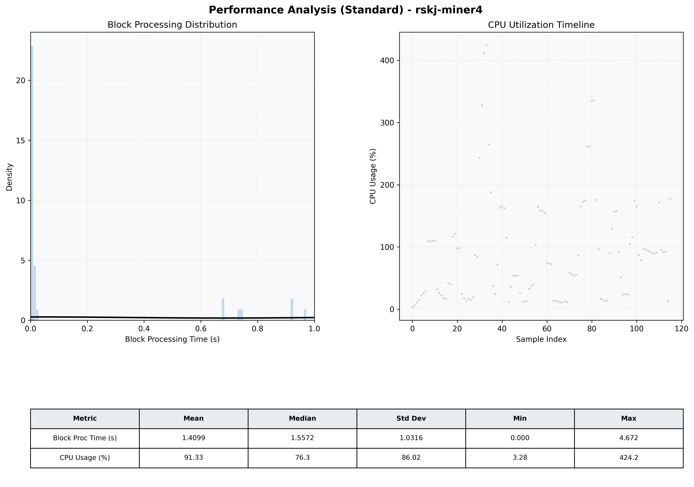

# Miner4 Quantitative Performance Report

| Category | Metric | Unit | Mean | Median | Min | Max |
| :--- | :--- | :--- | :--- | :--- | :--- | :--- |
| Processing | Block Processing Time | s | 1.410 | 1.557 | 0.000 | 4.672 |
|  | BlockExecution JMX | s | 0.398 | 0.009 | 0.001 | 0.988 |
| | Gas Consumed (per block) | M units | 7.30 | 10.00 | 0.00 | 10.00 |
| Resources | CPU Usage per Container | % | 91.33 | 76.29 | 3.28 | 424.15 |
|  | Memory Usage per Container | MiB | 1133.5 | 1158.4 | 474.0 | 1175.4 |
| JVM | JVM Heap Used | MiB | 437.9 | 440.0 | 23.8 | 848.4 |
| | JVM Heap Allocated | MiB | 2969.6 | 2969.6 | 2969.6 | 2969.6 |
| JVM GC | GC Copy Time | s | 0.0014 | 0.0012 | 0.000 | 0.006 |
| JVM GC | GC MarkSweep Time | s | 0.0000 | 0.0000 | 0.000 | 0.000 |
| Disk I/O | Disk Read | MiB/s | 0.000 | 0.000 | 0.000 | 0.000 |
|  | Disk Write | MiB/s | 4.973 | 3.379 | 0.552 | 26.760 |
| Network | Received Network Traffic per Container | KiB/s | 2.60 | 1.98 | 1.01 | 8.52 |
|  | Sent Network Traffic per Container | KiB/s | 11.26 | 10.62 | 8.06 | 16.71 |

