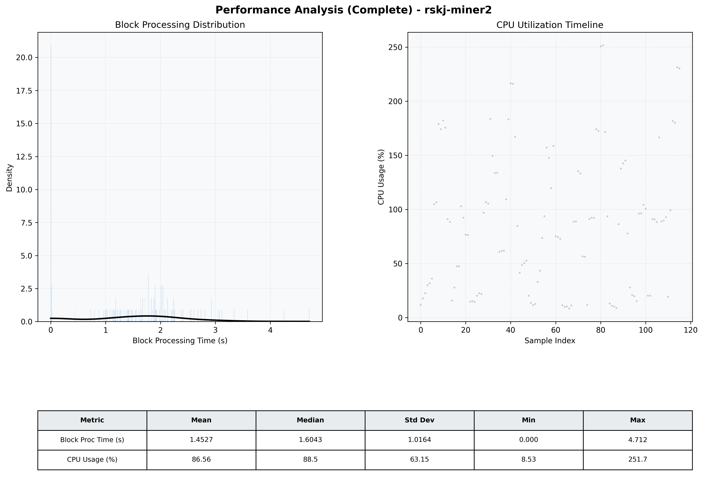

# Miner2 Quantitative Performance Report

| Category | Metric | Unit | Mean | Median | Min | Max |
| :--- | :--- | :--- | :--- | :--- | :--- | :--- |
| Processing | Block Processing Time | s | 1.453 | 1.604 | 0.000 | 4.712 |
|  | BlockExecution JMX | s | 0.986 | 1.088 | 0.001 | 2.482 |
| | Gas Consumed (per block) | M units | 7.30 | 10.00 | 0.00 | 10.00 |
| Resources | CPU Usage per Container | % | 86.56 | 88.46 | 8.53 | 251.66 |
|  | Memory Usage per Container | MiB | 1139.2 | 1148.2 | 600.1 | 1165.5 |
| JVM | JVM Heap Used | MiB | 431.8 | 436.0 | 25.9 | 826.1 |
| | JVM Heap Allocated | MiB | 2969.6 | 2969.6 | 2969.6 | 2969.6 |
| JVM GC | GC Copy Time | s | 0.0014 | 0.0012 | 0.000 | 0.007 |
| JVM GC | GC MarkSweep Time | s | 0.0000 | 0.0000 | 0.000 | 0.000 |
| Disk I/O | Disk Read | MiB/s | 0.000 | 0.000 | 0.000 | 0.000 |
|  | Disk Write | MiB/s | 4.449 | 3.103 | 0.000 | 18.759 |
| Network | Received Network Traffic per Container | KiB/s | 2.60 | 1.99 | 1.21 | 8.33 |
|  | Sent Network Traffic per Container | KiB/s | 11.32 | 10.66 | 8.76 | 18.58 |

