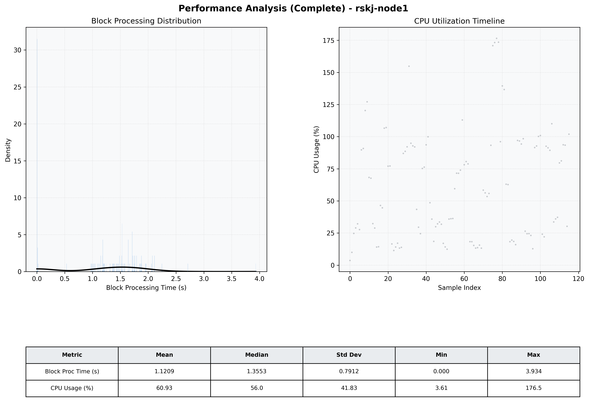

# Node1 Quantitative Performance Report

| Category | Metric | Unit | Mean | Median | Min | Max |
| :--- | :--- | :--- | :--- | :--- | :--- | :--- |
| Processing | Block Processing Time | s | 1.121 | 1.355 | 0.000 | 3.934 |
|  | BlockExecution JMX | s | 1.175 | 1.380 | 0.001 | 3.924 |
| | Gas Consumed (per block) | M units | 7.30 | 10.00 | 0.00 | 10.00 |
| Resources | CPU Usage per Container | % | 60.93 | 56.02 | 3.61 | 176.54 |
|  | Memory Usage per Container | MiB | 1133.2 | 1147.9 | 531.9 | 1157.9 |
| JVM | JVM Heap Used | MiB | 407.5 | 388.1 | 32.7 | 837.8 |
| | JVM Heap Allocated | MiB | 2969.6 | 2969.6 | 2969.6 | 2969.6 |
| JVM GC | GC Copy Time | s | 0.0011 | 0.0009 | 0.000 | 0.005 |
| JVM GC | GC MarkSweep Time | s | 0.0000 | 0.0000 | 0.000 | 0.000 |
| Disk I/O | Disk Read | MiB/s | 0.000 | 0.000 | 0.000 | 0.000 |
|  | Disk Write | MiB/s | 1.962 | 1.448 | 0.000 | 22.070 |
| Network | Received Network Traffic per Container | KiB/s | 2.63 | 2.02 | 1.04 | 8.54 |
|  | Sent Network Traffic per Container | KiB/s | 10.97 | 10.39 | 8.34 | 15.74 |

