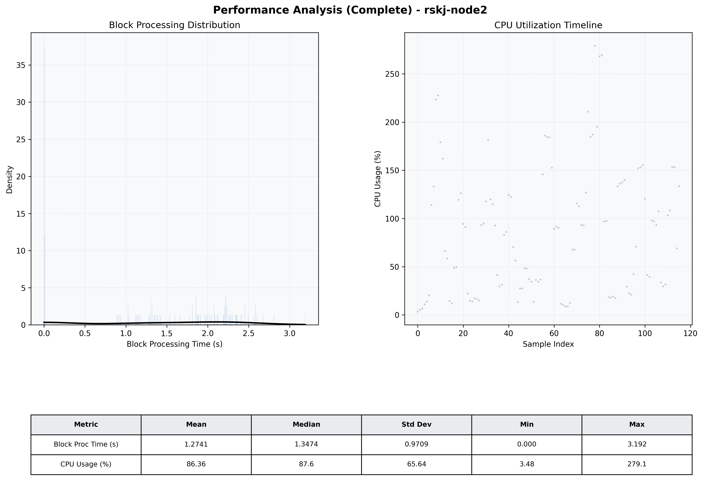

# Node2 Quantitative Performance Report

| Category | Metric | Unit | Mean | Median | Min | Max |
| :--- | :--- | :--- | :--- | :--- | :--- | :--- |
| Processing | Block Processing Time | s | 1.274 | 1.347 | 0.000 | 3.192 |
|  | BlockExecution JMX | s | 1.508 | 1.840 | 0.001 | 5.998 |
| | Gas Consumed (per block) | M units | 7.30 | 10.00 | 0.00 | 10.00 |
| Resources | CPU Usage per Container | % | 86.36 | 87.64 | 3.48 | 279.09 |
|  | Memory Usage per Container | MiB | 2228.2 | 2305.6 | 460.5 | 2315.2 |
| JVM | JVM Heap Used | MiB | 950.0 | 953.0 | 23.1 | 1831.5 |
| | JVM Heap Allocated | MiB | 3072.0 | 3072.0 | 3072.0 | 3072.0 |
| JVM GC | GC Copy Time | s | N/A | N/A | N/A | N/A |
| JVM GC | GC MarkSweep Time | s | N/A | N/A | N/A | N/A |
| Disk I/O | Disk Read | MiB/s | 0.000 | 0.000 | 0.000 | 0.000 |
|  | Disk Write | MiB/s | 1.517 | 1.379 | 0.000 | 4.276 |
| Network | Received Network Traffic per Container | KiB/s | 2.67 | 2.07 | 1.02 | 8.60 |
|  | Sent Network Traffic per Container | KiB/s | 10.24 | 9.73 | 8.16 | 15.05 |

