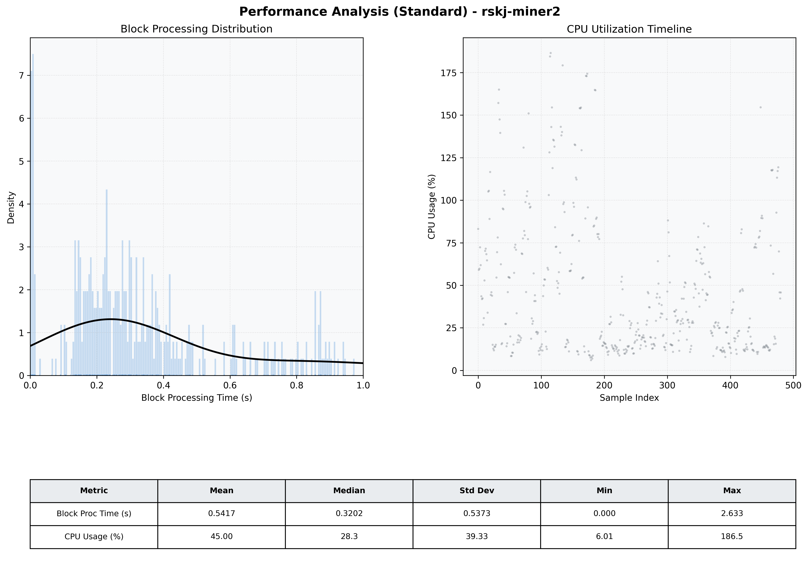

# Miner2 Quantitative Performance Report

| Category | Metric | Unit | Mean | Median | Min | Max |
| :--- | :--- | :--- | :--- | :--- | :--- | :--- |
| Processing | Block Processing Time | s | 0.542 | 0.320 | 0.000 | 2.633 |
|  | BlockExecution JMX | s | 0.282 | 0.168 | 0.002 | 0.991 |
| | Gas Consumed (per block) | M units | 8.22 | 10.00 | 0.00 | 10.00 |
| Resources | CPU Usage per Container | % | 45.00 | 28.27 | 6.01 | 186.49 |
|  | Memory Usage per Container | MiB | 1249.5 | 1237.1 | 1164.2 | 1335.2 |
| JVM | JVM Heap Used | MiB | 470.6 | 477.2 | 46.1 | 888.3 |
| | JVM Heap Allocated | MiB | 2969.6 | 2969.6 | 2969.6 | 2969.6 |
| JVM GC | GC Copy Time | s | 0.0005 | 0.0004 | 0.000 | 0.003 |
| JVM GC | GC MarkSweep Time | s | 0.0000 | 0.0000 | 0.000 | 0.000 |
| Disk I/O | Disk Read | MiB/s | 0.000 | 0.000 | 0.000 | 0.000 |
|  | Disk Write | MiB/s | 5.949 | 4.551 | 0.000 | 319.172 |
| Network | Received Network Traffic per Container | KiB/s | 3.16 | 2.37 | 1.17 | 10.90 |
|  | Sent Network Traffic per Container | KiB/s | 11.68 | 11.01 | 9.66 | 20.18 |

